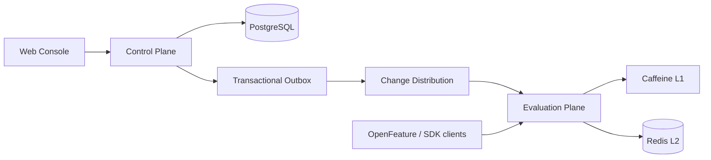

# FlagForge

**OpenFeature-native progressive delivery for safe, explainable, and low-latency feature releases.**

> Status: M0 foundation in progress. The first executable Spring Boot application and reproducible Maven build are available.

FlagForge is a multi-tenant platform that helps software teams decouple deployment from release. Teams can ship code behind feature flags, target selected users or organizations, perform deterministic percentage rollouts, understand every evaluation decision, and stop a risky release without redeploying an application.

## Why FlagForge?

Deploying code and exposing it to every customer at once creates unnecessary risk. Teams often compensate with environment variables, database switches, spreadsheets, or one-off configuration endpoints. Those approaches become hard to audit, slow to propagate, and dangerous as the number of services, environments, and teams grows.

FlagForge addresses four concrete problems:

- **Release safety:** expose a feature gradually and reduce its blast radius.
- **Operational control:** disable problematic behavior without a new deployment.
- **Decision visibility:** explain exactly why a subject received a variant.
- **Governance:** version, approve, audit, compare, and roll back production changes.

## Who is it for?

FlagForge is designed for engineering, platform, SRE, QA, and product teams that deploy frequently and need more control than static configuration provides. Its initial ideal customer profile is a small or medium-sized SaaS team with multiple environments, multiple customer organizations, and feature flags currently managed in-house.

It is intentionally not optimized for static sites, solo projects with infrequent releases, or authorization rules. Feature flags must not replace access control or permanent business logic.

## Product principles

1. **PostgreSQL is the source of truth.** Caches accelerate evaluation but never become authoritative.
2. **Published configuration is immutable.** Every publication produces a complete, versioned snapshot.
3. **Evaluation is deterministic.** The same flag version and evaluation context produce the same result.
4. **Tenant isolation is mandatory.** Tenant identity comes from authenticated context, never from an untrusted request field alone.
5. **Failures are explicit.** SDKs and APIs report whether a result came from a rule, rollout, default, stale snapshot, or error fallback.
6. **Complexity must be earned.** The project starts as a modular monolith and evolves only when a measured constraint justifies it.
7. **Interoperability matters.** The public evaluation experience targets OpenFeature compatibility.

## Core capabilities

### Initial product scope

- Organizations, members, projects, and environments.
- Role-based access control and environment-scoped API keys.
- Boolean and typed multivariate flags.
- Ordered targeting rules and reusable segments.
- Deterministic percentage rollouts.
- Draft, validation, publication, and immutable revision history.
- Evaluation reasons and a visual Evaluation Playground.
- Audit log and safe rollback.
- Java SDK and OpenFeature provider.

### Later evolution

- Approval workflows for protected environments.
- Multi-level cache with Caffeine and Redis.
- Best-effort push invalidation plus version reconciliation.
- Scheduled progressive rollouts with pause and rollback controls.
- Exposure events and operational rollout metrics.
- TypeScript SDK and configuration-as-code workflows.

## Example

A team deploys a new checkout while keeping it disabled by default:

```text
Flag: checkout-v2
Environment: production

1. Internal users                         -> enabled
2. country = BR AND plan = premium        -> 30% rollout
3. Everyone else                          -> disabled
```

For a specific evaluation, FlagForge returns both the value and its reason:

```json
{
  "flagKey": "checkout-v2",
  "value": true,
  "variant": "checkout-b",
  "reason": "TARGETING_MATCH",
  "matchedRule": "premium-users-brazil",
  "bucket": 14,
  "configurationVersion": 87
}
```

## Architecture direction

FlagForge separates two workloads logically from the beginning without forcing premature microservices:

- **Control Plane:** tenants, projects, flags, rules, publication, governance, and audit.
- **Evaluation Plane:** low-latency evaluation of complete published snapshots.



The first executable version can run both planes in one Spring Boot application. Module boundaries and contracts make independent deployment possible later if traffic, availability, or release cadence justifies it.

See [Architecture](docs/ARCHITECTURE.md), [Domain Model](docs/DOMAIN_MODEL.md), and the [ADR index](docs/adr/README.md) for the complete reasoning.

## Core invariants

- A flag key is unique within a project.
- A published revision is immutable.
- An evaluator never observes a partially published configuration.
- The same subject remains in the same rollout bucket for the same flag and allocation algorithm.
- Increasing a rollout percentage preserves subjects already included in the rollout.
- A tenant cannot read, mutate, evaluate, or infer another tenant's resources.
- Production publication uses optimistic concurrency to prevent silent overwrites.
- Rollback creates a new revision; it never rewrites history.
- Caches may be stale within a declared budget but cannot invent or partially merge revisions.
- Cyclic flag prerequisites are rejected before publication.

## Technology strategy

The target stack is deliberately modern but conservative:

| Area | Direction |
|---|---|
| Backend | Java 25, Spring Boot 4.1, Spring Modulith |
| Persistence | PostgreSQL, Flyway, Spring Data JDBC/JPA after a persistence spike |
| Cache | Caffeine L1; Redis L2 only after the single-node evaluator is correct |
| Frontend | Next.js, TypeScript, accessible component system |
| Interoperability | OpenFeature-compatible Java provider |
| API | REST/OpenAPI; SSE or polling for configuration updates |
| Testing | JUnit 5, Testcontainers, ArchUnit, property-based and concurrency tests |
| Observability | Micrometer, OpenTelemetry, Prometheus-compatible metrics |
| Delivery | Maven, Docker Compose, GitHub Actions |

Technology choices remain subject to ADRs and executable spikes. No component is included only to increase the stack count.

## Planned repository structure

```text
flagforge/
├── apps/
│   ├── control-api/
│   ├── evaluation-api/
│   └── web-console/
├── modules/
│   ├── identity/
│   ├── tenancy/
│   ├── projects/
│   ├── flags/
│   ├── targeting/
│   ├── publishing/
│   ├── evaluation/
│   ├── rollout/
│   ├── audit/
│   └── distribution/
├── sdk/
│   ├── java/
│   └── typescript/
├── docs/
│   └── adr/
└── infrastructure/
```

This is a target layout, not a commitment to create empty modules. Modules are added with working vertical slices.

## Delivery roadmap

| Milestone | Outcome |
|---|---|
| M0 — Foundation | Build, module boundaries, local PostgreSQL, CI, security and observability baseline |
| M1 — Deterministic Evaluator | Tenant model, flags, targeting, percentage rollout, evaluation API and playground |
| M2 — Safe Publishing | Immutable revisions, optimistic concurrency, audit, rollback and protected environments |
| M3 — Distributed Evaluation | Caffeine, Redis, outbox, invalidation, reconciliation, Java SDK and OpenFeature provider |
| M4 — Progressive Delivery | Scheduled rollout plans, health gates, live dashboard, benchmarks and portfolio demo |

The detailed scope and exit criteria are in [ROADMAP.md](docs/ROADMAP.md).

## Quality bar

A feature is complete only when:

- Its domain invariant is documented and tested.
- Tenant isolation is covered by negative tests.
- Failure behavior and fallback semantics are explicit.
- Public API behavior is represented in OpenAPI.
- Logs, metrics, and traces avoid secrets and high-cardinality subject identifiers.
- Architectural boundaries remain valid.
- Documentation reflects the delivered behavior.

See [TEST_STRATEGY.md](docs/TEST_STRATEGY.md) for the planned verification matrix.

## Current status

The repository is in **M0 / Foundation**. It contains the product specification, executable module-boundary verification, the Control API application, and a PostgreSQL/Flyway persistence baseline. Expanded quality gates and the security and observability baseline remain tracked as separate M0 issues.

## Quick start

### Requirements

- JDK 25.
- Docker Engine or Docker Desktop with Docker Compose.
- No system Maven installation is required. The wrapper downloads Maven 3.9.11.
- The committed database credentials are intentionally local-only defaults and must not be reused in another environment.

### Verify the build

Docker must be running. Testcontainers starts an isolated PostgreSQL 17.10 instance and verifies application startup, Flyway history, and migration validation.

Linux/macOS:

```bash
sh ./mvnw --batch-mode verify
```

Windows:

```powershell
.\mvnw.cmd --batch-mode verify
```

### Start local PostgreSQL

```bash
docker compose up -d --wait postgres
```

The defaults can be overridden with `FLAGFORGE_DB_NAME`, `FLAGFORGE_DB_USER`, `FLAGFORGE_DB_PASSWORD`, and `FLAGFORGE_DB_PORT`.

### Run the Control API

Linux/macOS:

```bash
sh ./mvnw --projects apps/control-api spring-boot:run
```

Windows:

```powershell
.\mvnw.cmd --projects apps/control-api spring-boot:run
```

The initial operational endpoints are:

```text
GET http://localhost:8080/actuator/health
GET http://localhost:8080/actuator/info
```

Stop the local database while preserving its volume:

```bash
docker compose down
```

Remove and recreate all local database state:

```bash
docker compose down --volumes
docker compose up -d --wait postgres
```

## Documentation

- [Product vision and target users](docs/VISION.md)
- [Architecture](docs/ARCHITECTURE.md)
- [Domain model and evaluation semantics](docs/DOMAIN_MODEL.md)
- [Roadmap and milestone exit criteria](docs/ROADMAP.md)
- [Testing strategy](docs/TEST_STRATEGY.md)
- [Security policy](SECURITY.md)
- [Architecture Decision Records](docs/adr/README.md)
- [Contributing](CONTRIBUTING.md)

## License

FlagForge is available under the [MIT License](LICENSE).
