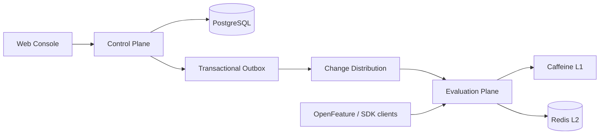
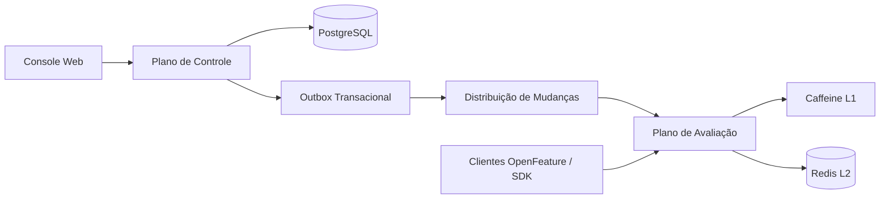

# FlagForge

**OpenFeature-native progressive delivery for safe, explainable, and low-latency feature releases.**

> Status: M0 through M2 delivered. The deterministic evaluator, immutable publication, append-only audit, rollback, and protected-environment approvals are executable. M3 — distributed evaluation — has not started.

FlagForge is a multi-tenant platform that helps software teams decouple deployment from release. Teams can ship code behind feature flags, target selected users or organizations, perform deterministic percentage rollouts, understand every evaluation decision, and stop a risky release without redeploying an application.

## Why FlagForge?

Deploying code and exposing it to every customer at once creates unnecessary risk. Teams often compensate with environment variables, database switches, spreadsheets, or one-off configuration endpoints. Those approaches become hard to audit, slow to propagate, and dangerous as the number of services, environments, and teams grows.

FlagForge addresses four concrete problems:

- **Release safety:** expose a feature gradually and reduce its blast radius.
- **Operational control:** disable problematic behavior without a new deployment.
- **Decision visibility:** explain exactly why a subject received a variant.
- **Governance:** version, approve, audit, compare, and roll back production changes.

## Who is it for?

FlagForge is designed for engineering, platform, SRE, QA, and product teams that deploy frequently and need more control than static configuration provides. Its initial ideal customer profile is a small or medium-sized SaaS team with multiple environments, multiple customer organizations, and feature flags currently managed in-house.

It is intentionally not optimized for static sites, solo projects with infrequent releases, or authorization rules. Feature flags must not replace access control or permanent business logic.

## Product principles

1. **PostgreSQL is the source of truth.** Caches accelerate evaluation but never become authoritative.
2. **Published configuration is immutable.** Every publication produces a complete, versioned snapshot.
3. **Evaluation is deterministic.** The same flag version and evaluation context produce the same result.
4. **Tenant isolation is mandatory.** Tenant identity comes from authenticated context, never from an untrusted request field alone.
5. **Failures are explicit.** SDKs and APIs report whether a result came from a rule, rollout, default, stale snapshot, or error fallback.
6. **Complexity must be earned.** The project starts as a modular monolith and evolves only when a measured constraint justifies it.
7. **Interoperability matters.** The public evaluation experience targets OpenFeature compatibility.

## Core capabilities

### Initial product scope

- Organizations, members, projects, and environments.
- Role-based access control and environment-scoped API keys.
- Boolean and typed multivariate flags.
- Ordered targeting rules and reusable segments.
- Deterministic percentage rollouts.
- Draft, validation, publication, and immutable revision history.
- Evaluation reasons and a visual Evaluation Playground.
- Audit log and safe rollback.
- Java SDK and OpenFeature provider.

### Later evolution

- Approval workflows for protected environments.
- Multi-level cache with Caffeine and Redis.
- Best-effort push invalidation plus version reconciliation.
- Scheduled progressive rollouts with pause and rollback controls.
- Exposure events and operational rollout metrics.
- TypeScript SDK and configuration-as-code workflows.

## Example

A team deploys a new checkout while keeping it disabled by default:

```text
Flag: checkout-v2
Environment: production

1. Internal users                         -> enabled
2. country = BR AND plan = premium        -> 30% rollout
3. Everyone else                          -> disabled
```

For a specific evaluation, FlagForge returns both the value and its reason:

```json
{
  "flagKey": "checkout-v2",
  "value": true,
  "variant": "checkout-b",
  "reason": "TARGETING_MATCH",
  "matchedRule": "premium-users-brazil",
  "bucket": 14,
  "configurationVersion": 87
}
```

## Architecture direction

FlagForge separates two workloads logically from the beginning without forcing premature microservices:

- **Control Plane:** tenants, projects, flags, rules, publication, governance, and audit.
- **Evaluation Plane:** low-latency evaluation of complete published snapshots.


```mermaid
flowchart LR
    UI["Web Console"] --> CP["Control Plane"]
    CP --> PG[("PostgreSQL")]
    CP --> OB["Transactional Outbox"]
    OB --> DIST["Change Distribution"]
    DIST --> EP["Evaluation Plane"]
    EP --> L1["Caffeine L1"]
    EP --> L2[("Redis L2")]
    SDK["OpenFeature / SDK clients"] --> EP
```

The first executable version can run both planes in one Spring Boot application. Module boundaries and contracts make independent deployment possible later if traffic, availability, or release cadence justifies it.

See [Architecture](docs/ARCHITECTURE.md), [Domain Model](docs/DOMAIN_MODEL.md), the [initial threat model](docs/THREAT_MODEL.md), and the [ADR index](docs/adr/README.md) for the complete reasoning.

## Core invariants

- A flag key is unique within a project.
- A published revision is immutable.
- An evaluator never observes a partially published configuration.
- The same subject remains in the same rollout bucket for the same flag and allocation algorithm.
- Increasing a rollout percentage preserves subjects already included in the rollout.
- A tenant cannot read, mutate, evaluate, or infer another tenant's resources.
- Production publication uses optimistic concurrency to prevent silent overwrites.
- Rollback creates a new revision; it never rewrites history.
- Caches may be stale within a declared budget but cannot invent or partially merge revisions.
- Cyclic flag prerequisites are rejected before publication.

## Technology strategy

The target stack is deliberately modern but conservative:

| Area | Direction |
|---|---|
| Backend | Java 25, Spring Boot 4.1, Spring Modulith |
| Persistence | PostgreSQL, Flyway, Spring Data JDBC/JPA after a persistence spike |
| Cache | Caffeine L1; Redis L2 only after the single-node evaluator is correct |
| Frontend | Next.js, TypeScript, accessible component system |
| Interoperability | OpenFeature-compatible Java provider |
| API | REST/OpenAPI; SSE or polling for configuration updates |
| Testing | JUnit 5, Testcontainers, ArchUnit, property-based and concurrency tests |
| Observability | Micrometer, OpenTelemetry, Prometheus-compatible metrics |
| Delivery | Maven, Docker Compose, GitHub Actions |

Technology choices remain subject to ADRs and executable spikes. No component is included only to increase the stack count.

## Planned repository structure

```text
flagforge/
├── apps/
│   ├── control-api/
│   ├── evaluation-api/
│   └── web-console/
├── modules/
│   ├── identity/
│   ├── tenancy/
│   ├── projects/
│   ├── flags/
│   ├── targeting/
│   ├── publishing/
│   ├── evaluation/
│   ├── rollout/
│   ├── audit/
│   └── distribution/
├── sdk/
│   ├── java/
│   └── typescript/
├── docs/
│   └── adr/
└── infrastructure/
```

This is a target layout, not a commitment to create empty modules. Modules are added with working vertical slices.

## Delivery roadmap

| Milestone | Outcome | Status |
|---|---|---|
| M0 — Foundation | Build, module boundaries, local PostgreSQL, CI, security and observability baseline | Delivered |
| M1 — Deterministic Evaluator | Tenant model, flags, targeting, percentage rollout, evaluation API and playground | Delivered |
| M2 — Safe Publishing | Immutable revisions, optimistic concurrency, audit, rollback and protected environments | Delivered |
| M3 — Distributed Evaluation | Caffeine, Redis, outbox, invalidation, reconciliation, Java SDK and OpenFeature provider | Not started |
| M4 — Progressive Delivery | Scheduled rollout plans, health gates, live dashboard, benchmarks and portfolio demo | Not started |

The detailed scope and exit criteria are in [ROADMAP.md](docs/ROADMAP.md).

## Quality bar

A feature is complete only when:

- Its domain invariant is documented and tested.
- Tenant isolation is covered by negative tests.
- Failure behavior and fallback semantics are explicit.
- Public API behavior is represented in OpenAPI.
- Logs, metrics, and traces avoid secrets and high-cardinality subject identifiers.
- Architectural boundaries remain valid.
- Documentation reflects the delivered behavior.

See [TEST_STRATEGY.md](docs/TEST_STRATEGY.md) for the planned verification matrix.

## Current status

**M0 — Foundation**, **M1 — Deterministic Evaluator**, and **M2 — Safe Publishing** are complete.

Delivered and covered by tests: executable module-boundary verification, the Control API application, the PostgreSQL/Flyway persistence baseline, the CI quality gate, security and observability defaults, the tenant hierarchy with row-based isolation, RBAC and environment-scoped SDK credentials, typed flags and variants, the ordered targeting and prerequisite engine, deterministic rollout allocation with conformance vectors, the evaluation API and its reason model, the web console foundation and Evaluation Playground, immutable snapshot publication with optimistic concurrency, append-only audit, deterministic configuration diff, rollback, and protected-environment change requests.

**M3 — Distributed Evaluation** has not started. Publication already writes transactional outbox rows, but they stay `PENDING` because no relay consumes them yet (#18). Caffeine and Redis caching (#19), the Java SDK and OpenFeature provider (#20), and reproducible benchmarks (#21) remain open.

One gap belongs to no milestone. The Control API has no human authentication mechanism and no HTTP endpoints for creating organizations, projects, environments, flags, or SDK credentials. Control-plane routes require an authenticated principal, but no configured login path can produce one, so an operator cannot yet administer the platform over HTTP. Evaluation is reachable today only with an SDK credential created through the service layer.

## Quick start

### Requirements

- JDK 25.
- Docker Engine or Docker Desktop with Docker Compose.
- No system Maven installation is required. The wrapper downloads Maven 3.9.11.
- The committed database credentials are intentionally local-only defaults and must not be reused in another environment.

### Verify the build

Docker must be running. Testcontainers starts an isolated PostgreSQL 17.10 instance and verifies application startup, Flyway history, and migration validation.

Linux/macOS:

```bash
sh ./mvnw --batch-mode verify
```

Windows:

```powershell
.\mvnw.cmd --batch-mode verify
```

### Start local PostgreSQL

```bash
docker compose up -d --wait postgres
```

The defaults can be overridden with `FLAGFORGE_DB_NAME`, `FLAGFORGE_DB_USER`, `FLAGFORGE_DB_PASSWORD`, and `FLAGFORGE_DB_PORT`.

### Run the Control API

Linux/macOS:

```bash
sh ./mvnw --projects apps/control-api spring-boot:run
```

Windows:

```powershell
.\mvnw.cmd --projects apps/control-api spring-boot:run
```

The initial public operational endpoints are:

```text
GET http://localhost:8080/actuator/health
GET http://localhost:8080/actuator/health/liveness
GET http://localhost:8080/actuator/health/readiness
GET http://localhost:8080/actuator/info
GET http://localhost:8080/livez
GET http://localhost:8080/readyz
```

All application routes are default-denied until the authentication and RBAC slice is delivered. Health responses never expose component details. Readiness includes PostgreSQL; liveness does not.

Structured ECS logs include a validated or generated `X-Correlation-ID`. OpenTelemetry integration is available, while OTLP trace export is disabled by default. It can be enabled explicitly with `FLAGFORGE_OTEL_EXPORT_ENABLED=true` and configured through `OTEL_EXPORTER_OTLP_TRACES_ENDPOINT`. Sampling is controlled by `FLAGFORGE_TRACING_SAMPLING_PROBABILITY`.

Stop the local database while preserving its volume:

```bash
docker compose down
```

Remove and recreate all local database state:

```bash
docker compose down --volumes
docker compose up -d --wait postgres
```

## Documentation

- [Product vision and target users](docs/VISION.md)
- [Architecture](docs/ARCHITECTURE.md)
- [Domain model and evaluation semantics](docs/DOMAIN_MODEL.md)
- [Roadmap and milestone exit criteria](docs/ROADMAP.md)
- [Testing strategy](docs/TEST_STRATEGY.md)
- [Security policy](SECURITY.md)
- [Architecture Decision Records](docs/adr/README.md)
- [Contributing](CONTRIBUTING.md)

## License

FlagForge is available under the [MIT License](LICENSE).

---

<details>
<summary><strong>🇧🇷 Português (pt-BR)</strong></summary>

# FlagForge

**Entrega progressiva nativa em OpenFeature para lançamentos de funcionalidades seguros, explicáveis e de baixa latência.**

> Status: M0 até M2 entregues. O avaliador determinístico, a publicação imutável, a auditoria somente-acréscimo, o rollback e as aprovações em ambiente protegido estão executáveis. O M3 — avaliação distribuída — ainda não começou.

O FlagForge é uma plataforma multi-tenant que ajuda times de software a desacoplar deploy de lançamento. Os times podem enviar código protegido por feature flags, direcionar usuários ou organizações específicas, executar rollouts percentuais determinísticos, entender cada decisão de avaliação e interromper um lançamento arriscado sem fazer um novo deploy da aplicação.

## Por que o FlagForge?

Fazer deploy de código e expô-lo a todos os clientes de uma vez cria risco desnecessário. Os times costumam compensar isso com variáveis de ambiente, chaves no banco de dados, planilhas ou endpoints de configuração improvisados. Essas abordagens ficam difíceis de auditar, lentas para propagar e perigosas conforme cresce o número de serviços, ambientes e times.

O FlagForge resolve quatro problemas concretos:

- **Segurança de lançamento:** expor uma funcionalidade gradualmente e reduzir seu raio de impacto.
- **Controle operacional:** desativar comportamento problemático sem um novo deploy.
- **Visibilidade da decisão:** explicar exatamente por que um sujeito recebeu determinada variante.
- **Governança:** versionar, aprovar, auditar, comparar e reverter mudanças em produção.

## Para quem é?

O FlagForge foi projetado para times de engenharia, plataforma, SRE, QA e produto que fazem deploy com frequência e precisam de mais controle do que a configuração estática oferece. Seu perfil de cliente ideal inicial é um time de SaaS de pequeno ou médio porte com múltiplos ambientes, múltiplas organizações clientes e feature flags atualmente mantidas internamente.

Ele intencionalmente não é otimizado para sites estáticos, projetos individuais com lançamentos raros ou regras de autorização. Feature flags não devem substituir controle de acesso nem regra de negócio permanente.

## Princípios do produto

1. **O PostgreSQL é a fonte da verdade.** Caches aceleram a avaliação, mas nunca se tornam autoritativos.
2. **A configuração publicada é imutável.** Toda publicação produz um snapshot completo e versionado.
3. **A avaliação é determinística.** A mesma versão de flag e o mesmo contexto de avaliação produzem o mesmo resultado.
4. **O isolamento entre tenants é obrigatório.** A identidade do tenant vem do contexto autenticado, nunca apenas de um campo não confiável da requisição.
5. **Falhas são explícitas.** SDKs e APIs informam se um resultado veio de uma regra, de um rollout, do padrão, de um snapshot desatualizado ou de um fallback de erro.
6. **Complexidade precisa ser conquistada.** O projeto começa como um monólito modular e evolui somente quando uma restrição medida justifica isso.
7. **Interoperabilidade importa.** A experiência pública de avaliação tem como alvo a compatibilidade com OpenFeature.

## Capacidades principais

### Escopo inicial do produto

- Organizações, membros, projetos e ambientes.
- Controle de acesso baseado em papéis e chaves de API com escopo de ambiente.
- Flags booleanas e multivariadas tipadas.
- Regras de segmentação ordenadas e segmentos reutilizáveis.
- Rollouts percentuais determinísticos.
- Rascunho, validação, publicação e histórico imutável de revisões.
- Razões de avaliação e um Evaluation Playground visual.
- Log de auditoria e rollback seguro.
- SDK Java e provider OpenFeature.

### Evolução posterior

- Fluxos de aprovação para ambientes protegidos.
- Cache multinível com Caffeine e Redis.
- Invalidação por push em regime de melhor esforço, somada à reconciliação de versões.
- Rollouts progressivos agendados com controles de pausa e rollback.
- Eventos de exposição e métricas operacionais de rollout.
- SDK TypeScript e fluxos de configuração como código.

## Exemplo

Um time faz deploy de um novo checkout mantendo-o desabilitado por padrão:

```text
Flag: checkout-v2
Ambiente: production

1. Usuários internos                      -> habilitado
2. country = BR AND plan = premium        -> rollout de 30%
3. Todo o restante                        -> desabilitado
```

Para uma avaliação específica, o FlagForge retorna tanto o valor quanto sua razão:

```json
{
  "flagKey": "checkout-v2",
  "value": true,
  "variant": "checkout-b",
  "reason": "TARGETING_MATCH",
  "matchedRule": "premium-users-brazil",
  "bucket": 14,
  "configurationVersion": 87
}
```

## Direção arquitetural

O FlagForge separa logicamente duas cargas de trabalho desde o início, sem forçar microsserviços prematuros:

- **Plano de Controle (Control Plane):** tenants, projetos, flags, regras, publicação, governança e auditoria.
- **Plano de Avaliação (Evaluation Plane):** avaliação de baixa latência sobre snapshots publicados completos.


```mermaid
flowchart LR
    UI["Console Web"] --> CP["Plano de Controle"]
    CP --> PG[("PostgreSQL")]
    CP --> OB["Outbox Transacional"]
    OB --> DIST["Distribuição de Mudanças"]
    DIST --> EP["Plano de Avaliação"]
    EP --> L1["Caffeine L1"]
    EP --> L2[("Redis L2")]
    SDK["Clientes OpenFeature / SDK"] --> EP
```

A primeira versão executável pode rodar ambos os planos em uma única aplicação Spring Boot. As fronteiras de módulo e os contratos tornam possível um deploy independente mais adiante, caso tráfego, disponibilidade ou cadência de lançamento justifiquem.

Consulte [Arquitetura](docs/ARCHITECTURE.md), [Modelo de Domínio](docs/DOMAIN_MODEL.md), o [modelo de ameaças inicial](docs/THREAT_MODEL.md) e o [índice de ADRs](docs/adr/README.md) para o raciocínio completo.

## Invariantes centrais

- Uma chave de flag é única dentro de um projeto.
- Uma revisão publicada é imutável.
- Um avaliador nunca observa uma configuração publicada parcialmente.
- O mesmo sujeito permanece no mesmo bucket de rollout para a mesma flag e o mesmo algoritmo de alocação.
- Aumentar o percentual de rollout preserva os sujeitos já incluídos no rollout.
- Um tenant não pode ler, alterar, avaliar ou inferir recursos de outro tenant.
- A publicação em produção usa concorrência otimista para impedir sobrescritas silenciosas.
- O rollback cria uma nova revisão; ele nunca reescreve o histórico.
- Caches podem ficar desatualizados dentro de um orçamento declarado, mas não podem inventar nem mesclar revisões parcialmente.
- Pré-requisitos cíclicos entre flags são rejeitados antes da publicação.

## Estratégia de tecnologia

A stack alvo é deliberadamente moderna, porém conservadora:

| Área | Direção |
|---|---|
| Backend | Java 25, Spring Boot 4.1, Spring Modulith |
| Persistência | PostgreSQL, Flyway, Spring Data JDBC/JPA após um spike de persistência |
| Cache | Caffeine L1; Redis L2 somente depois que o avaliador de nó único estiver correto |
| Frontend | Next.js, TypeScript, sistema de componentes acessível |
| Interoperabilidade | Provider Java compatível com OpenFeature |
| API | REST/OpenAPI; SSE ou polling para atualizações de configuração |
| Testes | JUnit 5, Testcontainers, ArchUnit, testes baseados em propriedades e de concorrência |
| Observabilidade | Micrometer, OpenTelemetry, métricas compatíveis com Prometheus |
| Entrega | Maven, Docker Compose, GitHub Actions |

As escolhas de tecnologia continuam sujeitas a ADRs e spikes executáveis. Nenhum componente é incluído apenas para aumentar a contagem da stack.

## Estrutura planejada do repositório

```text
flagforge/
├── apps/
│   ├── control-api/
│   ├── evaluation-api/
│   └── web-console/
├── modules/
│   ├── identity/
│   ├── tenancy/
│   ├── projects/
│   ├── flags/
│   ├── targeting/
│   ├── publishing/
│   ├── evaluation/
│   ├── rollout/
│   ├── audit/
│   └── distribution/
├── sdk/
│   ├── java/
│   └── typescript/
├── docs/
│   └── adr/
└── infrastructure/
```

Este é um layout alvo, não um compromisso de criar módulos vazios. Módulos são adicionados com fatias verticais funcionais.

## Roadmap de entrega

| Marco | Resultado | Status |
|---|---|---|
| M0 — Fundação | Build, fronteiras de módulo, PostgreSQL local, CI, baseline de segurança e observabilidade | Entregue |
| M1 — Avaliador Determinístico | Modelo de tenants, flags, segmentação, rollout percentual, API de avaliação e playground | Entregue |
| M2 — Publicação Segura | Revisões imutáveis, concorrência otimista, auditoria, rollback e ambientes protegidos | Entregue |
| M3 — Avaliação Distribuída | Caffeine, Redis, outbox, invalidação, reconciliação, SDK Java e provider OpenFeature | Não iniciado |
| M4 — Entrega Progressiva | Planos de rollout agendados, health gates, dashboard ao vivo, benchmarks e demo de portfólio | Não iniciado |

O escopo detalhado e os critérios de saída estão em [ROADMAP.md](docs/ROADMAP.md).

## Padrão de qualidade

Uma funcionalidade só está completa quando:

- Seu invariante de domínio está documentado e testado.
- O isolamento entre tenants está coberto por testes negativos.
- O comportamento de falha e a semântica de fallback são explícitos.
- O comportamento da API pública está representado no OpenAPI.
- Logs, métricas e traces evitam segredos e identificadores de sujeito de alta cardinalidade.
- As fronteiras arquiteturais permanecem válidas.
- A documentação reflete o comportamento entregue.

Consulte [TEST_STRATEGY.md](docs/TEST_STRATEGY.md) para a matriz de verificação planejada.

## Status atual

**M0 — Fundação**, **M1 — Avaliador Determinístico** e **M2 — Publicação Segura** estão concluídos.

Entregue e coberto por testes: verificação executável das fronteiras de módulo, a aplicação Control API, o baseline de persistência PostgreSQL/Flyway, o quality gate de CI, os padrões de segurança e observabilidade, a hierarquia de tenants com isolamento por linha, RBAC e credenciais de SDK com escopo de ambiente, flags e variantes tipadas, o motor de segmentação ordenada e pré-requisitos, a alocação determinística de rollout com vetores de conformidade, a API de avaliação e seu modelo de razões, a fundação do console web e o Evaluation Playground, a publicação de snapshots imutáveis com concorrência otimista, a auditoria somente-acréscimo, o diff determinístico de configuração, o rollback e as solicitações de mudança em ambiente protegido.

O **M3 — Avaliação Distribuída** ainda não começou. A publicação já grava linhas no outbox transacional, mas elas permanecem em `PENDING` porque nenhum relay as consome ainda (#18). O cache com Caffeine e Redis (#19), o SDK Java e o provider OpenFeature (#20) e os benchmarks reprodutíveis (#21) seguem abertos.

Uma lacuna não pertence a nenhum marco. A Control API não tem mecanismo de autenticação humana nem endpoints HTTP para criar organizações, projetos, ambientes, flags ou credenciais de SDK. As rotas do plano de controle exigem um principal autenticado, mas nenhum caminho de login configurado consegue produzi-lo, de modo que um operador ainda não administra a plataforma por HTTP. Hoje, a avaliação só é alcançável com uma credencial de SDK criada pela camada de serviço.

## Início rápido

### Requisitos

- JDK 25.
- Docker Engine ou Docker Desktop com Docker Compose.
- Nenhuma instalação de Maven no sistema é necessária. O wrapper baixa o Maven 3.9.11.
- As credenciais de banco versionadas são intencionalmente padrões apenas locais e não devem ser reutilizadas em outro ambiente.

### Verificar o build

O Docker precisa estar em execução. O Testcontainers sobe uma instância isolada do PostgreSQL 17.10 e verifica a inicialização da aplicação, o histórico do Flyway e a validação das migrações.

Linux/macOS:

```bash
sh ./mvnw --batch-mode verify
```

Windows:

```powershell
.\mvnw.cmd --batch-mode verify
```

### Subir o PostgreSQL local

```bash
docker compose up -d --wait postgres
```

Os padrões podem ser sobrescritos com `FLAGFORGE_DB_NAME`, `FLAGFORGE_DB_USER`, `FLAGFORGE_DB_PASSWORD` e `FLAGFORGE_DB_PORT`.

### Executar a Control API

Linux/macOS:

```bash
sh ./mvnw --projects apps/control-api spring-boot:run
```

Windows:

```powershell
.\mvnw.cmd --projects apps/control-api spring-boot:run
```

Os endpoints operacionais públicos iniciais são:

```text
GET http://localhost:8080/actuator/health
GET http://localhost:8080/actuator/health/liveness
GET http://localhost:8080/actuator/health/readiness
GET http://localhost:8080/actuator/info
GET http://localhost:8080/livez
GET http://localhost:8080/readyz
```

Todas as rotas da aplicação são negadas por padrão até que a fatia de autenticação e RBAC seja entregue. As respostas de health nunca expõem detalhes de componentes. O readiness inclui o PostgreSQL; o liveness não.

Os logs estruturados em ECS incluem um `X-Correlation-ID` validado ou gerado. A integração com OpenTelemetry está disponível, enquanto a exportação de traces via OTLP fica desabilitada por padrão. Ela pode ser habilitada explicitamente com `FLAGFORGE_OTEL_EXPORT_ENABLED=true` e configurada por `OTEL_EXPORTER_OTLP_TRACES_ENDPOINT`. A amostragem é controlada por `FLAGFORGE_TRACING_SAMPLING_PROBABILITY`.

Parar o banco local preservando seu volume:

```bash
docker compose down
```

Remover e recriar todo o estado local do banco:

```bash
docker compose down --volumes
docker compose up -d --wait postgres
```

## Documentação

- [Visão de produto e usuários-alvo](docs/VISION.md)
- [Arquitetura](docs/ARCHITECTURE.md)
- [Modelo de domínio e semântica de avaliação](docs/DOMAIN_MODEL.md)
- [Roadmap e critérios de saída dos marcos](docs/ROADMAP.md)
- [Estratégia de testes](docs/TEST_STRATEGY.md)
- [Política de segurança](SECURITY.md)
- [Architecture Decision Records](docs/adr/README.md)
- [Como contribuir](CONTRIBUTING.md)

## Licença

O FlagForge está disponível sob a [Licença MIT](LICENSE).

</details>
