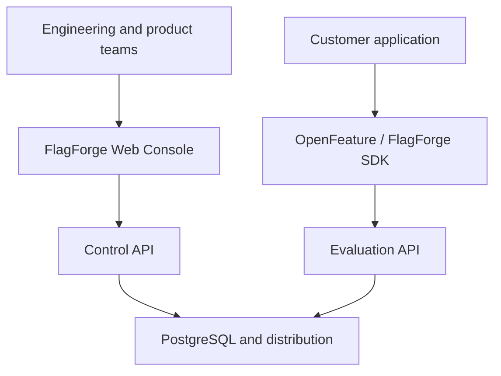
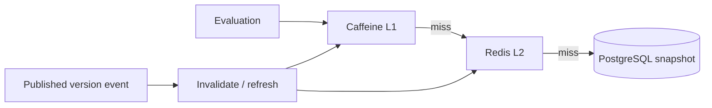

# Architecture

## Architectural goals

FlagForge must make administrative writes safe while keeping flag evaluation fast and resilient. These workloads have different characteristics, but the project begins as a modular monolith so that domain boundaries can mature before deployment boundaries are introduced.

## System context



## Logical planes

### Control Plane

Optimized for correctness and governance:

- Organization and membership management.
- Projects, environments, flags, segments, and rules.
- Draft editing and validation.
- Publication and optimistic concurrency.
- Change requests, approvals, audit, and rollback.
- Snapshot compilation and outbox creation.

### Evaluation Plane

Optimized for predictable reads:

- Load one complete published snapshot by environment and version.
- Evaluate flags deterministically.
- Return values, variants, reasons, and version metadata.
- Serve from local memory when shared infrastructure is temporarily unavailable.
- Reconcile local versions with the source of truth.

## Modular boundaries

| Module | Responsibility | Owns |
|---|---|---|
| identity | Authentication principals and credentials | users, service credentials |
| tenancy | Organizations, membership, roles, quotas | organizations, memberships |
| projects | Projects and environments | projects, environments |
| flags | Flag lifecycle and variants | feature flags, variants |
| targeting | Rules, segments, operators, dependency validation | rules, segments |
| publishing | Draft validation, revisions, snapshots | revisions, snapshots, change requests |
| evaluation | Deterministic evaluation engine and reason model | evaluation contracts, no authoritative config |
| distribution | Outbox relay, invalidation, version reconciliation | outbox and delivery state |
| rollout | Scheduled progression, pause, resume, rollback policy | rollout plans and steps |
| audit | Append-only security and configuration history | audit events |

Modules communicate through explicit application services, stable contracts, and domain events. Direct access to another module's internal package or tables is prohibited.

## Persistence model

PostgreSQL is the authoritative store. All tenant-owned records include an organization identifier, and uniqueness constraints include the tenant boundary where applicable.

Publication performs one local transaction that:

1. Verifies the expected draft/revision version.
2. Validates the complete candidate configuration.
3. Persists an immutable revision and compiled snapshot.
4. Updates the environment's current published version.
5. Appends an audit record.
6. Inserts a transactional outbox entry.

External publication or cache communication never occurs inside this database transaction.

## Snapshot model

An evaluation snapshot is a complete, immutable configuration for one project environment at one version. Evaluators never merge individual flag records from different versions.

Conceptual identity:

```text
organization / project / environment / version
```

A snapshot contains the flags, variants, ordered rules, referenced segments, prerequisite graph, algorithm version, and checksum needed for offline evaluation.

## Cache and distribution

The cache is introduced only after the evaluator works correctly from PostgreSQL.



Rules:

- Cache entries are immutable and keyed by environment plus version.
- A small pointer maps an environment to its currently known version.
- Push invalidation is best effort; periodic reconciliation repairs missed messages.
- Request coalescing prevents a cache stampede for the same snapshot.
- A last-known-good snapshot may be served only within an explicit staleness budget.
- Fail-open, fail-closed, and default behavior are configured and reported, never inferred silently.

## Evaluation request

Minimum inputs:

```json
{
  "flagKey": "checkout-v2",
  "targetingKey": "customer-492",
  "attributes": {
    "country": "BR",
    "plan": "premium"
  }
}
```

Minimum response metadata:

```json
{
  "value": true,
  "variant": "checkout-b",
  "reason": "TARGETING_MATCH",
  "configurationVersion": 87,
  "errorCode": null
}
```

## Consistency model

Control Plane reads after publication are strongly consistent with PostgreSQL. Evaluation Plane replicas are eventually consistent within a declared propagation and reconciliation budget.

The API exposes the evaluated version so clients and operators can detect divergence. A kill switch can use a stricter propagation path later, but no global consistency claim is made without measurement.

## Deployment evolution

### Stage 1 — One application

One Spring Boot runtime, one PostgreSQL database, no Redis. Logical plane and module boundaries are still enforced.

### Stage 2 — Replicated application

Multiple identical instances, Caffeine local cache, Redis shared cache/invalidation, and version reconciliation.

### Stage 3 — Independent runtimes

Control and Evaluation APIs may become independent deployables from the same repository when evaluation traffic or availability requirements justify it.

## Security architecture

- Human access uses OIDC/OAuth2 and organization membership.
- Server-side SDKs use environment-scoped keys with minimum permissions.
- Client-side keys, if introduced, can only access explicitly client-safe flags.
- API keys are displayed once and stored as strong hashes.
- Tenant identity is derived from the authenticated credential.
- Production changes are auditable and can require a second approver.
- Sensitive attributes and targeting keys are not placed in metric labels.

## Observability

The system measures:

- Evaluation latency and throughput.
- L1 and L2 hit ratios.
- Configuration versions served per instance.
- Publication-to-availability propagation delay.
- Fallback and stale evaluation counts.
- Outbox age and delivery failures.
- Optimistic concurrency conflicts.

Trace and log correlation uses request and publication identifiers. Raw targeting keys and secrets must not be logged.

## Open questions requiring spikes

- Spring Data JDBC versus JPA for aggregate persistence.
- Snapshot representation and compression threshold.
- Polling, SSE, or both for the first Java SDK transport.
- Redis Pub/Sub versus another best-effort notification mechanism.
- PostgreSQL row-level security as defense in depth after application isolation is proven.

