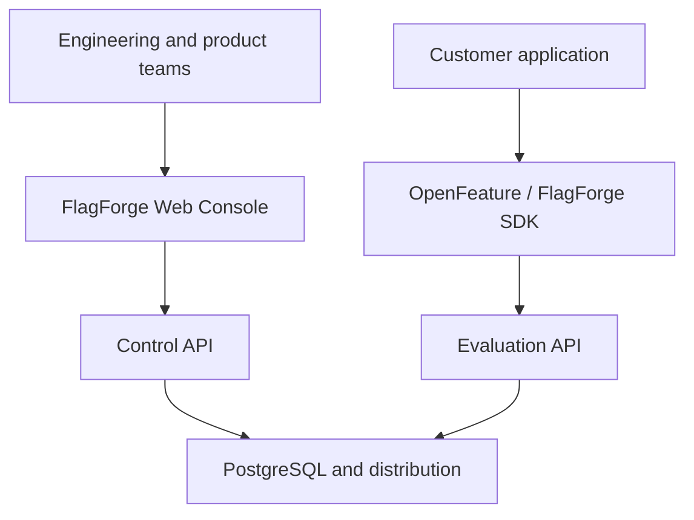
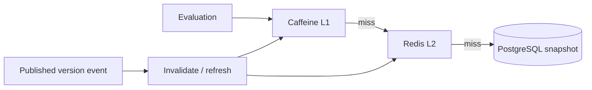
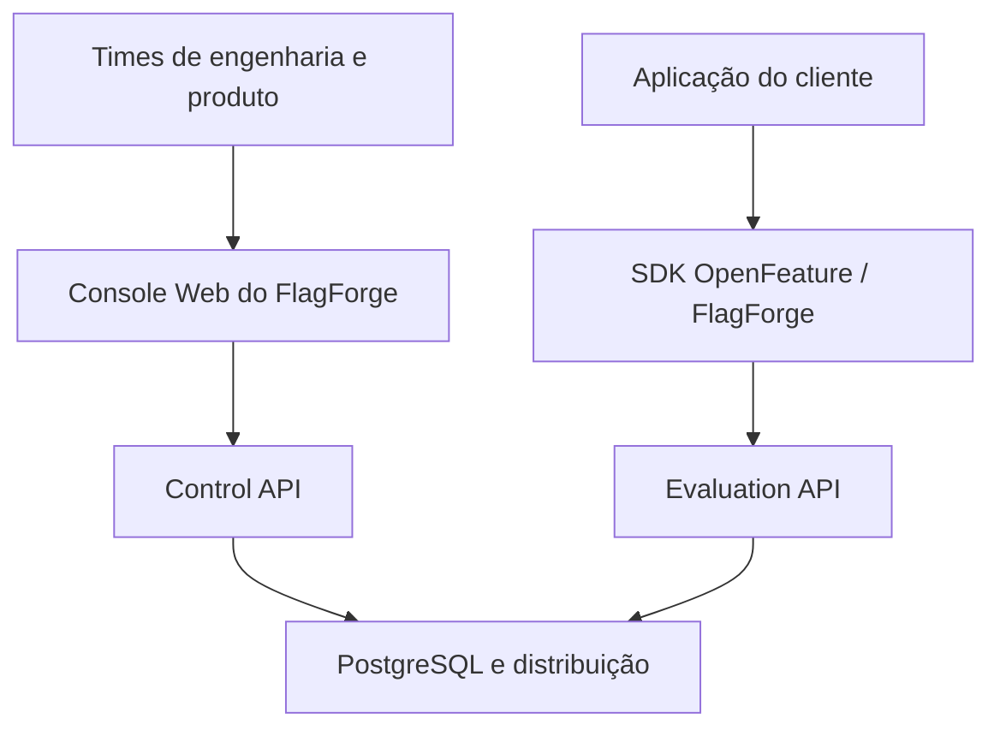
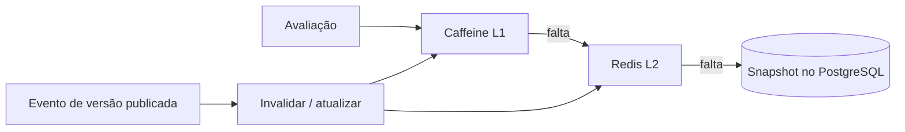

# Architecture

## Architectural goals

FlagForge must make administrative writes safe while keeping flag evaluation fast and resilient. These workloads have different characteristics, but the project begins as a modular monolith so that domain boundaries can mature before deployment boundaries are introduced.

## System context


```mermaid
flowchart TD
    Team["Engineering and product teams"] --> Console["FlagForge Web Console"]
    Console --> Control["Control API"]
    App["Customer application"] --> SDK["OpenFeature / FlagForge SDK"]
    SDK --> Eval["Evaluation API"]
    Control --> Data["PostgreSQL and distribution"]
    Eval --> Data
```

## Logical planes

### Control Plane

Optimized for correctness and governance:

- Organization and membership management.
- Projects, environments, flags, segments, and rules.
- Draft editing and validation.
- Publication and optimistic concurrency.
- Change requests, approvals, audit, and rollback.
- Snapshot compilation and outbox creation.

### Evaluation Plane

Optimized for predictable reads:

- Load one complete published snapshot by environment and version.
- Evaluate flags deterministically.
- Return values, variants, reasons, and version metadata.
- Serve from local memory when shared infrastructure is temporarily unavailable.
- Reconcile local versions with the source of truth.

## Modular boundaries

| Module | Responsibility | Owns |
|---|---|---|
| identity | Reserved. Human identity is external (ADR 0007), so no user store is planned; SDK credentials are owned by `credentials` | — |
| tenancy | Organizations, membership, roles, quotas | organizations, memberships |
| projects | Projects and environments | projects, environments |
| flags | Flag lifecycle and variants | feature flags, variants |
| targeting | Rules, segments, operators, dependency validation | rules, segments |
| publishing | Draft validation, revisions, snapshots | revisions, snapshots, change requests |
| evaluation | Deterministic evaluation engine and reason model | evaluation contracts, no authoritative config |
| distribution | Outbox relay, invalidation, version reconciliation | outbox and delivery state |
| rollout | Scheduled progression, pause, resume, rollback policy | rollout plans and steps |
| audit | Append-only security and configuration history | audit events |

Modules communicate through explicit application services, stable contracts, and domain events. Direct access to another module's internal package or tables is prohibited.

### Executable module verification

Spring Modulith derives application modules from direct subpackages below the application root. A module's root package is its default public API; nested packages are internal unless a deliberate named interface exposes them.

The Maven `verify` lifecycle executes architecture tests that:

- call `ApplicationModules.verify()` to reject module cycles, references to internal packages, and violations of explicitly allowed dependencies;
- generate PlantUML component diagrams and module canvases under `target/spring-modulith-docs`;
- run an isolated, deliberately invalid test fixture that proves cycles and cross-module access to an `internal` package are rejected.

The invalid fixture lives outside the production package namespace. Production modules are added only with working vertical slices; empty placeholder modules are not created merely to populate a diagram.

## Persistence model

PostgreSQL is the authoritative store. All tenant-owned records include an organization identifier, and uniqueness constraints include the tenant boundary where applicable.

Publication performs one local transaction that:

1. Verifies the expected draft/revision version.
2. Validates the complete candidate configuration.
3. Persists an immutable revision and compiled snapshot.
4. Updates the environment's current published version.
5. Appends an audit record.
6. Inserts a transactional outbox entry.

External publication or cache communication never occurs inside this database transaction.

## Snapshot model

An evaluation snapshot is a complete, immutable configuration for one project environment at one version. Evaluators never merge individual flag records from different versions.

Conceptual identity:

```text
organization / project / environment / version
```

A snapshot contains the flags, variants, ordered rules, referenced segments, prerequisite graph, algorithm version, and checksum needed for offline evaluation.

## Cache and distribution

The cache is introduced only after the evaluator works correctly from PostgreSQL.


```mermaid
flowchart LR
    Request["Evaluation"] --> L1["Caffeine L1"]
    L1 -->|miss| L2["Redis L2"]
    L2 -->|miss| PG[("PostgreSQL snapshot")]
    Publish["Published version event"] --> Invalidate["Invalidate / refresh"]
    Invalidate --> L1
    Invalidate --> L2
```

Rules:

- Cache entries are immutable and keyed by environment plus version.
- A small pointer maps an environment to its currently known version.
- Push invalidation is best effort; periodic reconciliation repairs missed messages.
- Request coalescing prevents a cache stampede for the same snapshot.
- A last-known-good snapshot may be served only within an explicit staleness budget.
- Fail-open, fail-closed, and default behavior are configured and reported, never inferred silently.

## Evaluation request

Minimum inputs:

```json
{
  "flagKey": "checkout-v2",
  "targetingKey": "customer-492",
  "attributes": {
    "country": "BR",
    "plan": "premium"
  }
}
```

Minimum response metadata:

```json
{
  "value": true,
  "variant": "checkout-b",
  "reason": "TARGETING_MATCH",
  "configurationVersion": 87,
  "errorCode": null
}
```

## Consistency model

Control Plane reads after publication are strongly consistent with PostgreSQL. Evaluation Plane replicas are eventually consistent within a declared propagation and reconciliation budget.

The API exposes the evaluated version so clients and operators can detect divergence. A kill switch can use a stricter propagation path later, but no global consistency claim is made without measurement.

## Deployment evolution

### Stage 1 — One application

One Spring Boot runtime, one PostgreSQL database, no Redis. Logical plane and module boundaries are still enforced.

### Stage 2 — Replicated application

Multiple identical instances, Caffeine local cache, Redis shared cache/invalidation, and version reconciliation.

### Stage 3 — Independent runtimes

Control and Evaluation APIs may become independent deployables from the same repository when evaluation traffic or availability requirements justify it.

## Security architecture

- Human access uses OIDC/OAuth2; the acting organization is selected per request and accepted only against an ACTIVE membership.
- Server-side SDKs use environment-scoped keys with minimum permissions.
- Client-side keys, if introduced, can only access explicitly client-safe flags.
- API keys are displayed once and stored as strong hashes.
- Tenant identity is derived from the authenticated credential.
- Production changes are auditable and can require a second approver.
- Sensitive attributes and targeting keys are not placed in metric labels.

## Observability

The system measures:

- Evaluation latency and throughput.
- L1 and L2 hit ratios.
- Configuration versions served per instance.
- Publication-to-availability propagation delay.
- Fallback and stale evaluation counts.
- Outbox age and delivery failures.
- Optimistic concurrency conflicts.

Trace and log correlation uses request and publication identifiers. Raw targeting keys and secrets must not be logged.

## Open questions requiring spikes

- Spring Data JDBC versus JPA for aggregate persistence.
- Snapshot representation and compression threshold.
- Polling, SSE, or both for the first Java SDK transport.
- Redis Pub/Sub versus another best-effort notification mechanism.
- PostgreSQL row-level security as defense in depth after application isolation is proven.


---

<details>
<summary><strong>🇧🇷 Português (pt-BR)</strong></summary>

# Arquitetura

## Objetivos arquiteturais

O FlagForge precisa tornar as escritas administrativas seguras mantendo a avaliação de flags rápida e resiliente. Essas cargas de trabalho têm características diferentes, mas o projeto começa como um monólito modular para que as fronteiras de domínio amadureçam antes de introduzir fronteiras de deploy.

## Contexto do sistema


```mermaid
flowchart TD
    Team["Times de engenharia e produto"] --> Console["Console Web do FlagForge"]
    Console --> Control["Control API"]
    App["Aplicação do cliente"] --> SDK["SDK OpenFeature / FlagForge"]
    SDK --> Eval["Evaluation API"]
    Control --> Data["PostgreSQL e distribuição"]
    Eval --> Data
```

## Planos lógicos

### Plano de Controle

Otimizado para correção e governança:

- Gestão de organizações e associações.
- Projetos, ambientes, flags, segmentos e regras.
- Edição e validação de rascunhos.
- Publicação e concorrência otimista.
- Solicitações de mudança, aprovações, auditoria e rollback.
- Compilação de snapshots e criação de entradas de outbox.

### Plano de Avaliação

Otimizado para leituras previsíveis:

- Carregar um snapshot publicado completo por ambiente e versão.
- Avaliar flags de forma determinística.
- Retornar valores, variantes, razões e metadados de versão.
- Servir a partir da memória local quando a infraestrutura compartilhada estiver temporariamente indisponível.
- Reconciliar versões locais com a fonte da verdade.

## Fronteiras modulares

| Módulo | Responsabilidade | Possui |
|---|---|---|
| identity | Reservado. A identidade humana é externa (ADR 0007), então nenhum store de usuários está previsto; as credenciais de SDK pertencem a `credentials` | — |
| tenancy | Organizações, associação, papéis, cotas | organizações, associações |
| projects | Projetos e ambientes | projetos, ambientes |
| flags | Ciclo de vida das flags e variantes | feature flags, variantes |
| targeting | Regras, segmentos, operadores, validação de dependências | regras, segmentos |
| publishing | Validação de rascunho, revisões, snapshots | revisões, snapshots, solicitações de mudança |
| evaluation | Motor de avaliação determinístico e modelo de razões | contratos de avaliação, nenhuma configuração autoritativa |
| distribution | Relay do outbox, invalidação, reconciliação de versões | outbox e estado de entrega |
| rollout | Progressão agendada, pausa, retomada, política de rollback | planos e etapas de rollout |
| audit | Histórico somente-acréscimo de segurança e configuração | eventos de auditoria |

Os módulos se comunicam por serviços de aplicação explícitos, contratos estáveis e eventos de domínio. É proibido o acesso direto ao pacote interno ou às tabelas de outro módulo.

### Verificação executável de módulos

O Spring Modulith deriva os módulos da aplicação a partir dos subpacotes diretos abaixo da raiz da aplicação. O pacote raiz de um módulo é sua API pública padrão; pacotes aninhados são internos, salvo se uma interface nomeada deliberada os expuser.

O ciclo `verify` do Maven executa testes de arquitetura que:

- chamam `ApplicationModules.verify()` para rejeitar ciclos entre módulos, referências a pacotes internos e violações de dependências explicitamente permitidas;
- geram diagramas de componentes em PlantUML e canvases de módulo em `target/spring-modulith-docs`;
- executam um fixture de teste isolado e deliberadamente inválido que comprova que ciclos e acesso entre módulos a um pacote `internal` são rejeitados.

O fixture inválido vive fora do namespace de pacotes de produção. Módulos de produção são adicionados apenas com fatias verticais funcionais; módulos vazios de reserva não são criados só para preencher um diagrama.

## Modelo de persistência

O PostgreSQL é o armazenamento autoritativo. Todo registro pertencente a um tenant inclui um identificador de organização, e as constraints de unicidade incluem a fronteira do tenant onde aplicável.

A publicação executa uma transação local que:

1. Verifica a versão esperada do rascunho/revisão.
2. Valida a configuração candidata completa.
3. Persiste uma revisão imutável e o snapshot compilado.
4. Atualiza a versão publicada atual do ambiente.
5. Acrescenta um registro de auditoria.
6. Insere uma entrada no outbox transacional.

Comunicação externa de publicação ou de cache nunca ocorre dentro dessa transação de banco de dados.

## Modelo de snapshot

Um snapshot de avaliação é uma configuração completa e imutável de um ambiente de projeto em uma versão. Os avaliadores nunca mesclam registros individuais de flags de versões diferentes.

Identidade conceitual:

```text
organização / projeto / ambiente / versão
```

Um snapshot contém as flags, variantes, regras ordenadas, segmentos referenciados, grafo de pré-requisitos, versão do algoritmo e checksum necessários para avaliação offline.

## Cache e distribuição

O cache só é introduzido depois que o avaliador funciona corretamente a partir do PostgreSQL.


```mermaid
flowchart LR
    Request["Avaliação"] --> L1["Caffeine L1"]
    L1 -->|falta| L2["Redis L2"]
    L2 -->|falta| PG[("Snapshot no PostgreSQL")]
    Publish["Evento de versão publicada"] --> Invalidate["Invalidar / atualizar"]
    Invalidate --> L1
    Invalidate --> L2
```

Regras:

- Entradas de cache são imutáveis e chaveadas por ambiente mais versão.
- Um pequeno ponteiro mapeia um ambiente para a versão atualmente conhecida.
- A invalidação por push é de melhor esforço; a reconciliação periódica repara mensagens perdidas.
- A coalescência de requisições evita estouro de cache (stampede) para o mesmo snapshot.
- Um snapshot de último estado bom conhecido só pode ser servido dentro de um orçamento explícito de defasagem.
- Comportamentos fail-open, fail-closed e padrão são configurados e reportados, nunca inferidos silenciosamente.


## Requisição de avaliação

Entradas mínimas:

```json
{
  "flagKey": "checkout-v2",
  "targetingKey": "customer-492",
  "attributes": {
    "country": "BR",
    "plan": "premium"
  }
}
```

Metadados mínimos de resposta:

```json
{
  "value": true,
  "variant": "checkout-b",
  "reason": "TARGETING_MATCH",
  "configurationVersion": 87,
  "errorCode": null
}
```

## Modelo de consistência

As leituras do Plano de Controle após a publicação são fortemente consistentes com o PostgreSQL. As réplicas do Plano de Avaliação são eventualmente consistentes dentro de um orçamento declarado de propagação e reconciliação.

A API expõe a versão avaliada para que clientes e operadores detectem divergência. Um kill switch pode usar um caminho de propagação mais estrito no futuro, mas nenhuma afirmação de consistência global é feita sem medição.

## Evolução do deploy

### Estágio 1 — Uma aplicação

Um runtime Spring Boot, um banco PostgreSQL, sem Redis. As fronteiras de plano lógico e de módulo continuam sendo impostas.

### Estágio 2 — Aplicação replicada

Múltiplas instâncias idênticas, cache local Caffeine, cache/invalidação compartilhados no Redis e reconciliação de versões.

### Estágio 3 — Runtimes independentes

As APIs de Controle e de Avaliação podem se tornar artefatos de deploy independentes a partir do mesmo repositório quando o tráfego de avaliação ou os requisitos de disponibilidade justificarem.

## Arquitetura de segurança

- O acesso humano usa OIDC/OAuth2; a organização em que se age é selecionada por requisição e aceita apenas contra uma associação ACTIVE.
- SDKs do lado do servidor usam chaves com escopo de ambiente e permissões mínimas.
- Chaves do lado do cliente, se introduzidas, só podem acessar flags explicitamente seguras para cliente.
- Chaves de API são exibidas uma única vez e armazenadas como hashes fortes.
- A identidade do tenant é derivada da credencial autenticada.
- Mudanças em produção são auditáveis e podem exigir um segundo aprovador.
- Atributos sensíveis e chaves de segmentação não são colocados em rótulos de métrica.

## Observabilidade

O sistema mede:

- Latência e throughput de avaliação.
- Taxas de acerto de L1 e L2.
- Versões de configuração servidas por instância.
- Atraso de propagação da publicação até a disponibilidade.
- Contagens de avaliações em fallback e defasadas.
- Idade do outbox e falhas de entrega.
- Conflitos de concorrência otimista.

A correlação de traces e logs usa identificadores de requisição e de publicação. Chaves de segmentação em texto puro e segredos não devem ser registrados em log.

## Questões abertas que exigem spikes

- Spring Data JDBC versus JPA para persistência de agregados.
- Representação do snapshot e limiar de compressão.
- Polling, SSE ou ambos para o primeiro transporte do SDK Java.
- Redis Pub/Sub versus outro mecanismo de notificação de melhor esforço.
- Row-level security do PostgreSQL como defesa em profundidade após o isolamento na aplicação estar comprovado.

</details>
