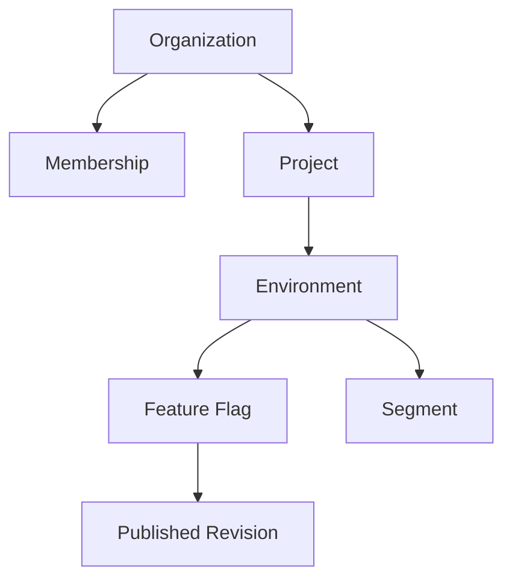
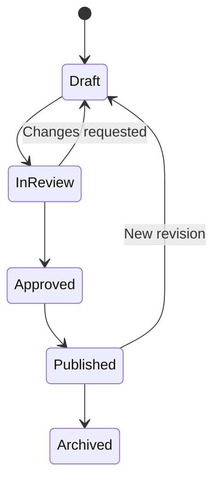

# Domain Model and Evaluation Semantics

## Tenant hierarchy


```mermaid
flowchart TD
    Org["Organization"] --> Member["Membership"]
    Org --> Project["Project"]
    Project --> Env["Environment"]
    Env --> Flag["Feature Flag"]
    Env --> Segment["Segment"]
    Flag --> Revision["Published Revision"]
```

## Main concepts

### Organization

The tenant boundary. Owns projects, members, roles, quotas, and audit history. Organization slugs are stable, globally unique public boundaries; tenant-owned child keys are unique only inside their documented organization or project scope.

### Membership

Links one authenticated actor identifier to one organization. Memberships have ACTIVE or SUSPENDED state and one explicit role:

- OWNER has every Control Plane permission, including organization ownership changes.
- ADMIN manages memberships, projects, environments, and SDK credentials, but cannot grant or alter OWNER authority.
- DEVELOPER reads organization and membership metadata and can write projects and environments.
- VIEWER has read-only access to organization, membership, project, environment, and credential metadata.

Authorization is checked before resource lookup. This prevents permission failures from becoming a resource-enumeration channel.

An organization is bootstrapped together with an OWNER founding membership in one PostgreSQL transaction. Normal tenant operations accept no caller-supplied organization identifier; the organization is derived from the authenticated principal and checked against an active membership.

### Project

A software product or bounded application context. Flag keys are unique inside a project so the same logical key can exist safely in another project.

### Environment

An isolated configuration space such as development, staging, production, `qa-blue`, or any other valid project-local key. The familiar development, staging, and production names are examples only and are never automatically seeded or hard-coded. Credentials and publication protection are environment-scoped.

The database stores the organization identifier on every environment and enforces a composite foreign key to `(organization_id, project_id)`, preventing an environment from referencing another tenant's project.

### SDK Credential

An environment-scoped machine credential that authorizes evaluation only. Its plaintext format contains a public lookup identifier and a cryptographically random 256-bit secret. Plaintext is returned only when the credential is created or rotated; PostgreSQL stores only the SHA-256 hash of the random secret plus non-sensitive metadata.

Credentials can be listed by metadata, rotated, and revoked. Rotation creates a new credential linked to its predecessor and revokes the predecessor in one transaction. Authentication validates organization, environment, EVALUATE scope, ACTIVE status, and the secret using a constant-time comparison. Invalid, revoked, unknown, cross-environment, and cross-tenant credentials share the same generic failure contract.

### Feature Flag

A stable key and metadata describing a runtime decision. A flag has a value type, lifecycle state, ownership, variants, rules, default behavior, and optional prerequisites.

Initial types:

- Boolean.
- String.
- Integer/decimal.
- JSON object with a bounded payload size.

### Variant

A named typed value, such as `control`, `checkout-a`, or `checkout-b`. Named variants make evaluation and exposure metrics understandable.

### Segment

A reusable set of inclusion, exclusion, or attribute rules. Segments are environment-local in the first version to avoid ambiguous cross-environment behavior.

### Rule

An ordered condition set with an outcome. Conditions inside a rule are combined with `AND` initially. Multiple rules are evaluated by ascending priority; the first matching rule wins.

### Revision

An immutable published configuration version. Rollback produces a new revision based on an earlier one.

### Evaluation Context

Contains a stable targeting key and optional typed attributes. Context data is supplied for evaluation and is not automatically persisted as a user profile.

## Flag lifecycle


```mermaid
stateDiagram-v2
    [*] --> Draft
    Draft --> InReview
    InReview --> Draft: Changes requested
    InReview --> Approved
    Approved --> Published
    Published --> Archived
    Published --> Draft: New revision
```

Approval is optional in non-protected environments and policy-controlled in production.

## Evaluation algorithm

For a requested flag and context:

1. Resolve the complete published snapshot.
2. Find the flag by stable key.
3. Validate flag state and type.
4. Evaluate prerequisites in topological order.
5. Apply explicit subject exclusions and inclusions.
6. Evaluate ordered targeting rules.
7. If a matching rule contains a percentage allocation, calculate the deterministic bucket.
8. Return the selected variant or the default variant.
9. Include the evaluation reason, rule identifier, snapshot version, and error metadata.

## Percentage allocation

The allocation input is conceptually:

```text
algorithmVersion + organizationId + projectId + environmentId + flagKey + targetingKey
```

A stable hash is mapped into a fixed bucket range. The exact hash and normalization algorithm must be specified, versioned, and covered by fixed test vectors so every SDK returns the same result.

Required properties:

- Deterministic across processes and programming languages.
- Uniform enough for rollout allocation.
- Stable for the same algorithm version.
- Monotonic for simple rollout increases: subjects included at 20% remain included at 30%.

## Evaluation reasons

Initial reason taxonomy:

| Reason | Meaning |
|---|---|
| `TARGETING_MATCH` | An ordered rule matched |
| `SPLIT` | A percentage allocation selected the variant |
| `DEFAULT` | No rule matched |
| `DISABLED` | The flag is administratively disabled |
| `PREREQUISITE_FAILED` | A required flag did not match |
| `STALE` | A last-known-good snapshot was used |
| `ERROR` | Evaluation failed and returned a declared fallback |

## Invariants

### Tenant and identity

- Every tenant-owned aggregate belongs to exactly one organization.
- Resource lookup includes the authenticated organization boundary.
- Missing resources and resources owned by another organization produce the same generic not-found contract.
- A principal claiming an organization without an ACTIVE membership is rejected before resource access.
- Environment credentials cannot administer Control Plane resources.
- SDK credential plaintext is never persisted and is returned only at creation or rotation.
- SDK credentials authorize only their own organization and environment.
- Revoked credentials stop authorizing new requests.
- Missing, invalid, revoked, and wrongly scoped credentials fail with the same generic authentication contract.

### Publication

- A revision is immutable after publication.
- Publication is atomic inside PostgreSQL.
- The publisher supplies an expected version.
- Exactly one current published version is referenced per environment.
- Invalid prerequisite graphs cannot be published.

### Evaluation

- A response comes from one complete snapshot version.
- Type mismatch never silently coerces a value.
- Evaluation terminates even when malformed dependency input is encountered.
- Equal normalized inputs and configuration produce equal outputs.

### Audit

- Security and publication audit records are append-only through the application.
- Each record identifies actor, tenant, action, resource, timestamp, and correlation identifier.
- Secrets and full sensitive evaluation contexts are not stored in the audit log.

## Explicit non-equivalences

Feature flags are not:

- Authorization or entitlements.
- A replacement for database migrations.
- Permanent business rules.
- A guarantee that old code paths can remain indefinitely.

Each release flag should have an owner and expected removal date to control flag debt.

