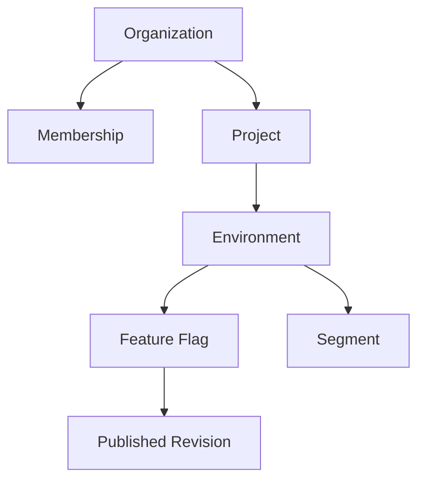
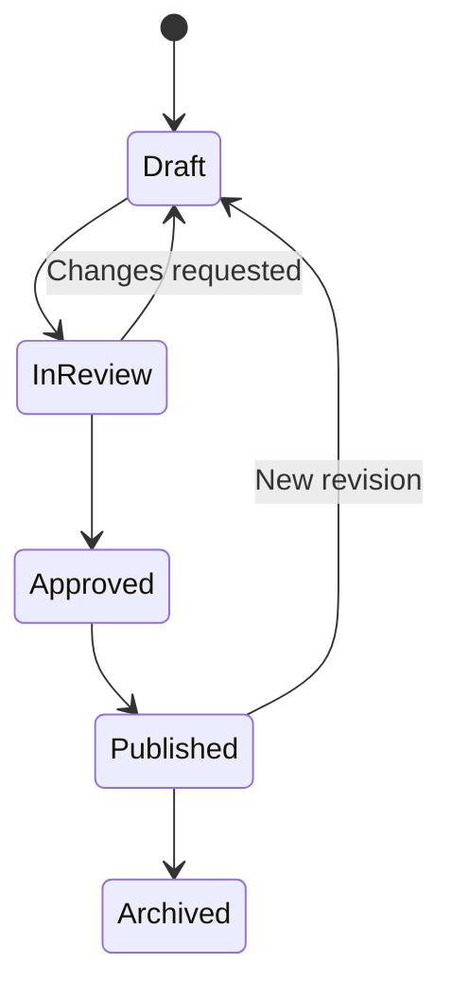
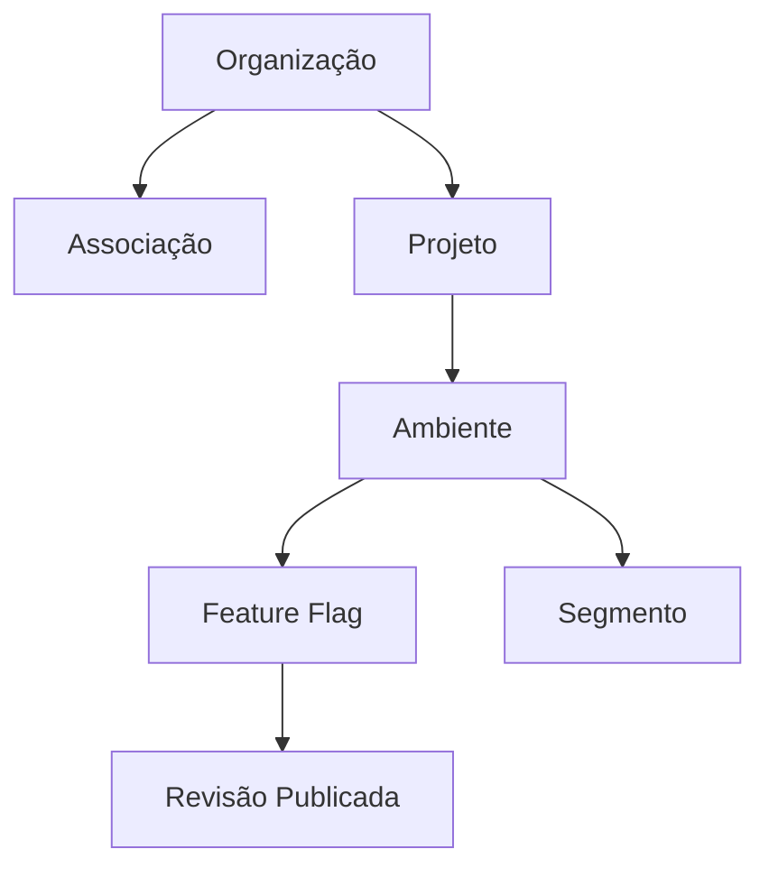
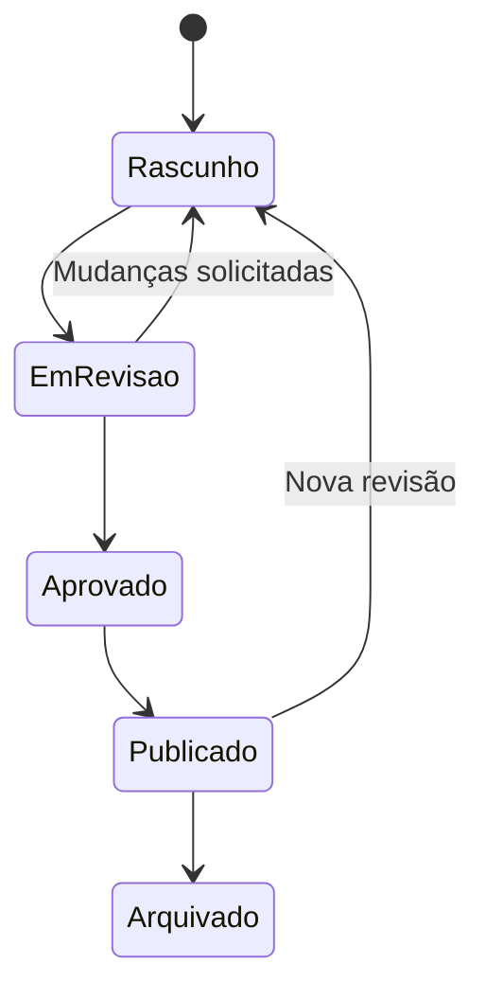

# Domain Model and Evaluation Semantics

## Tenant hierarchy


```mermaid
flowchart TD
    Org["Organization"] --> Member["Membership"]
    Org --> Project["Project"]
    Project --> Env["Environment"]
    Env --> Flag["Feature Flag"]
    Env --> Segment["Segment"]
    Flag --> Revision["Published Revision"]
```

## Main concepts

### Organization

The tenant boundary. Owns projects, members, roles, quotas, and audit history. Organization slugs are stable, globally unique public boundaries; tenant-owned child keys are unique only inside their documented organization or project scope.

### Membership

Links one authenticated actor identifier to one organization. Memberships have ACTIVE or SUSPENDED state and one explicit role:

- OWNER has every Control Plane permission, including organization ownership changes. Every organization must retain at least one ACTIVE OWNER.
- ADMIN manages memberships, projects, environments, and SDK credentials, but cannot grant or alter OWNER authority.
- DEVELOPER reads organization and membership metadata and can write projects and environments.
- VIEWER has read-only access to organization, membership, project, environment, and credential metadata.

Authorization is checked before resource lookup. This prevents permission failures from becoming a resource-enumeration channel.

An organization is bootstrapped together with an OWNER founding membership in one PostgreSQL transaction. Normal tenant operations accept no caller-supplied organization identifier; the organization is derived from the authenticated principal and checked against an active membership.

### Project

A software product or bounded application context. Flag keys are unique inside a project so the same logical key can exist safely in another project.

### Environment

An isolated configuration space such as development, staging, production, `qa-blue`, or any other valid project-local key. The familiar development, staging, and production names are examples only and are never automatically seeded or hard-coded. Credentials and publication protection are environment-scoped.

The database stores the organization identifier on every environment and enforces a composite foreign key to `(organization_id, project_id)`, preventing an environment from referencing another tenant's project.

### SDK Credential

An environment-scoped machine credential that authorizes evaluation only. Its plaintext format contains a public lookup identifier and a cryptographically random 256-bit secret. Plaintext is returned only when the credential is created or rotated; PostgreSQL stores only the SHA-256 hash of the random secret plus non-sensitive metadata.

Credentials can be listed by metadata, rotated, and revoked. Rotation creates a new credential linked to its predecessor and revokes the predecessor in one transaction. Authentication validates organization, environment, EVALUATE scope, ACTIVE status, and the secret using a constant-time comparison. Invalid, revoked, unknown, cross-environment, and cross-tenant credentials share the same generic failure contract.

### Feature Flag

A stable key and metadata describing a runtime decision. A flag has a value type, lifecycle state, ownership, variants, rules, default behavior, and optional prerequisites.

The first executable types are:

- BOOLEAN, with named boolean variants such as `disabled=false` and `enabled=true`.
- STRING, with named variants such as `control=classic` and `compact=compact-v2`.

NUMBER and JSON remain reserved in the schema and enum so their storage contracts are explicit, but creation is rejected with a stable `UNSUPPORTED_VALUE_TYPE` code until numeric normalization and bounded JSON validation are fully implemented. Values are never silently coerced between types.

### Variant

A named typed value, such as `disabled`, `enabled`, `control`, `checkout-a`, or `checkout-b`. Every variant has exactly the same immutable value type as its flag. Variant keys are unique per flag, and the declared default must reference an existing variant. Named variants make evaluation and exposure metrics understandable.

### Segment

A reusable set of inclusion, exclusion, or attribute rules. Segments are environment-local in the first version to avoid ambiguous cross-environment behavior.

### Rule

An ordered condition set with an outcome. Conditions inside a rule are combined with `AND` initially. Multiple rules are evaluated by ascending priority; the first matching rule wins.

### Revision

An immutable published configuration version. Rollback produces a new revision based on an earlier one.

### Evaluation Context

Contains a stable targeting key and optional typed attributes. Context data is supplied for evaluation and is not automatically persisted as a user profile.

## Flag lifecycle


```mermaid
stateDiagram-v2
    [*] --> Draft
    Draft --> InReview
    InReview --> Draft: Changes requested
    InReview --> Approved
    Approved --> Published
    Published --> Archived
    Published --> Draft: New revision
```

Approval is optional in non-protected environments and policy-controlled in production.

Stable flag identity has a smaller lifecycle before published revisions exist:

- ACTIVE flags can be resolved for evaluation and editing.
- ARCHIVED flags remain readable for history but cannot be resolved as active.
- A project cannot reuse an archived key, especially with an incompatible type.
- RELEASE and EXPERIMENT flags require an expected removal date; OPERATIONAL and KILL_SWITCH flags may be permanent.

## Evaluation algorithm

For a requested flag and context:

1. Resolve the complete published snapshot.
2. Find the flag by stable key.
3. Validate flag state and type.
4. Evaluate prerequisites in topological order.
5. Apply explicit subject exclusions and inclusions.
6. Evaluate ordered targeting rules.
7. If a matching rule contains a percentage allocation, calculate the deterministic bucket.
8. Return the selected variant or the default variant.
9. Include the evaluation reason, rule identifier, snapshot version, and error metadata.

## Percentage allocation

The allocation input is conceptually:

```text
algorithmVersion + organizationId + projectId + environmentId + flagKey + targetingKey
```

A stable hash is mapped into a fixed bucket range. The exact hash and normalization algorithm must be specified, versioned, and covered by fixed test vectors so every SDK returns the same result.

Required properties:

- Deterministic across processes and programming languages.
- Uniform enough for rollout allocation.
- Stable for the same algorithm version.
- Monotonic for simple rollout increases: subjects included at 20% remain included at 30%.

## Evaluation reasons

Initial reason taxonomy:

| Reason | Meaning |
|---|---|
| `TARGETING_MATCH` | An ordered rule matched |
| `SPLIT` | A percentage allocation selected the variant |
| `DEFAULT` | No rule matched |
| `DISABLED` | The flag is administratively disabled |
| `PREREQUISITE_FAILED` | A required flag did not match |
| `STALE` | A last-known-good snapshot was used |
| `ERROR` | Evaluation failed and returned a declared fallback |

## Invariants

### Tenant and identity

- Every tenant-owned aggregate belongs to exactly one organization.
- Resource lookup includes the authenticated organization boundary.
- Missing resources and resources owned by another organization produce the same generic not-found contract.
- A principal claiming an organization without an ACTIVE membership is rejected before resource access.
- Environment credentials cannot administer Control Plane resources.
- SDK credential plaintext is never persisted and is returned only at creation or rotation.
- SDK credentials authorize only their own organization and environment.
- Revoked credentials stop authorizing new requests.
- Missing, invalid, revoked, and wrongly scoped credentials fail with the same generic authentication contract.

### Publication

- A revision is immutable after publication.
- Publication is atomic inside PostgreSQL.
- The publisher supplies an expected version.
- Exactly one current published version is referenced per environment.
- Invalid prerequisite graphs cannot be published.

### Evaluation

- A response comes from one complete snapshot version.
- Type mismatch never silently coerces a value.
- Stable flag keys are unique inside a project and cannot change value type.
- Archived flags preserve metadata and variants while leaving the active lookup path.
- Evaluation terminates even when malformed dependency input is encountered.
- Equal normalized inputs and configuration produce equal outputs.

### Audit

- Security and publication audit records are append-only through the application.
- Each record identifies actor, tenant, action, resource, timestamp, and correlation identifier.
- Secrets and full sensitive evaluation contexts are not stored in the audit log.

## Explicit non-equivalences

Feature flags are not:

- Authorization or entitlements.
- A replacement for database migrations.
- Permanent business rules.
- A guarantee that old code paths can remain indefinitely.

Each release flag should have an owner and expected removal date to control flag debt.


---

<details>
<summary><strong>🇧🇷 Português (pt-BR)</strong></summary>

# Modelo de Domínio e Semântica de Avaliação

## Hierarquia de tenants


```mermaid
flowchart TD
    Org["Organização"] --> Member["Associação"]
    Org --> Project["Projeto"]
    Project --> Env["Ambiente"]
    Env --> Flag["Feature Flag"]
    Env --> Segment["Segmento"]
    Flag --> Revision["Revisão Publicada"]
```

## Conceitos principais

### Organização

A fronteira do tenant. Possui projetos, membros, papéis, cotas e histórico de auditoria. Os slugs de organização são fronteiras públicas estáveis e globalmente únicas; as chaves filhas pertencentes ao tenant são únicas apenas dentro do escopo documentado de sua organização ou projeto.

### Associação (Membership)

Vincula o identificador de um ator autenticado a uma organização. Associações têm estado ACTIVE ou SUSPENDED e um papel explícito:

- OWNER tem todas as permissões do Plano de Controle, incluindo mudanças de titularidade da organização. Toda organização deve manter ao menos um OWNER ACTIVE.
- ADMIN gerencia associações, projetos, ambientes e credenciais de SDK, mas não pode conceder nem alterar autoridade de OWNER.
- DEVELOPER lê metadados de organização e associação e pode escrever projetos e ambientes.
- VIEWER tem acesso somente leitura a metadados de organização, associação, projeto, ambiente e credenciais.

A autorização é verificada antes da busca do recurso. Isso impede que falhas de permissão se tornem um canal de enumeração de recursos.

Uma organização é inicializada junto com uma associação fundadora OWNER em uma única transação PostgreSQL. As operações normais de tenant não aceitam identificador de organização fornecido pelo chamador; a organização é derivada do principal autenticado e verificada contra uma associação ativa.

### Projeto

Um produto de software ou contexto de aplicação delimitado. As chaves de flag são únicas dentro de um projeto, de modo que a mesma chave lógica pode existir com segurança em outro projeto.

### Ambiente

Um espaço de configuração isolado, como development, staging, production, `qa-blue` ou qualquer outra chave válida local ao projeto. Os nomes familiares development, staging e production são apenas exemplos e nunca são semeados automaticamente nem fixados no código. Credenciais e proteção de publicação têm escopo de ambiente.

O banco de dados armazena o identificador da organização em todo ambiente e impõe uma chave estrangeira composta para `(organization_id, project_id)`, impedindo que um ambiente referencie o projeto de outro tenant.

### Credencial de SDK

Uma credencial de máquina com escopo de ambiente que autoriza apenas avaliação. Seu formato em texto plano contém um identificador público de consulta e um segredo aleatório criptográfico de 256 bits. O texto plano só é retornado quando a credencial é criada ou rotacionada; o PostgreSQL armazena apenas o hash SHA-256 do segredo aleatório mais metadados não sensíveis.

As credenciais podem ser listadas por metadados, rotacionadas e revogadas. A rotação cria uma nova credencial vinculada à sua antecessora e revoga a antecessora em uma única transação. A autenticação valida organização, ambiente, escopo EVALUATE, status ACTIVE e o segredo usando comparação em tempo constante. Credenciais inválidas, revogadas, desconhecidas, de outro ambiente e de outro tenant compartilham o mesmo contrato genérico de falha.

### Feature Flag

Uma chave estável e metadados que descrevem uma decisão em tempo de execução. Uma flag tem tipo de valor, estado de ciclo de vida, propriedade, variantes, regras, comportamento padrão e pré-requisitos opcionais.

Os primeiros tipos executáveis são:

- BOOLEAN, com variantes booleanas nomeadas, como `disabled=false` e `enabled=true`.
- STRING, com variantes nomeadas, como `control=classic` e `compact=compact-v2`.

NUMBER e JSON permanecem reservados no schema e no enum para que seus contratos de armazenamento sejam explícitos, mas a criação é rejeitada com um código estável `UNSUPPORTED_VALUE_TYPE` até que a normalização numérica e a validação limitada de JSON estejam plenamente implementadas. Valores nunca são coagidos silenciosamente entre tipos.

### Variante

Um valor tipado e nomeado, como `disabled`, `enabled`, `control`, `checkout-a` ou `checkout-b`. Toda variante tem exatamente o mesmo tipo de valor imutável de sua flag. As chaves de variante são únicas por flag, e o padrão declarado deve referenciar uma variante existente. Variantes nomeadas tornam compreensíveis as métricas de avaliação e de exposição.

### Segmento

Um conjunto reutilizável de regras de inclusão, exclusão ou atributo. Na primeira versão, os segmentos são locais ao ambiente, para evitar comportamento ambíguo entre ambientes.

### Regra

Um conjunto ordenado de condições com um desfecho. Inicialmente, as condições dentro de uma regra são combinadas com `AND`. Múltiplas regras são avaliadas por prioridade ascendente; a primeira regra que casar vence.

### Revisão

Uma versão de configuração publicada e imutável. O rollback produz uma nova revisão baseada em uma anterior.

### Contexto de Avaliação

Contém uma chave de segmentação estável e atributos tipados opcionais. Os dados de contexto são fornecidos para a avaliação e não são persistidos automaticamente como perfil de usuário.

## Ciclo de vida da flag


```mermaid
stateDiagram-v2
    [*] --> Rascunho
    Rascunho --> EmRevisao
    EmRevisao --> Rascunho: Mudanças solicitadas
    EmRevisao --> Aprovado
    Aprovado --> Publicado
    Publicado --> Arquivado
    Publicado --> Rascunho: Nova revisão
```

A aprovação é opcional em ambientes não protegidos e controlada por política em produção.

A identidade estável da flag tem um ciclo de vida menor, anterior à existência de revisões publicadas:

- Flags ACTIVE podem ser resolvidas para avaliação e edição.
- Flags ARCHIVED permanecem legíveis para histórico, mas não podem ser resolvidas como ativas.
- Um projeto não pode reutilizar uma chave arquivada, especialmente com um tipo incompatível.
- Flags RELEASE e EXPERIMENT exigem uma data prevista de remoção; flags OPERATIONAL e KILL_SWITCH podem ser permanentes.

## Algoritmo de avaliação

Para uma flag e um contexto requisitados:

1. Resolver o snapshot publicado completo.
2. Encontrar a flag pela chave estável.
3. Validar o estado e o tipo da flag.
4. Avaliar os pré-requisitos em ordem topológica.
5. Aplicar exclusões e inclusões explícitas de sujeitos.
6. Avaliar as regras de segmentação ordenadas.
7. Se a regra que casou contiver uma alocação percentual, calcular o bucket determinístico.
8. Retornar a variante selecionada ou a variante padrão.
9. Incluir a razão da avaliação, o identificador da regra, a versão do snapshot e os metadados de erro.

## Alocação percentual

A entrada da alocação é, conceitualmente:

```text
algorithmVersion + organizationId + projectId + environmentId + flagKey + targetingKey
```

Um hash estável é mapeado em uma faixa fixa de buckets. O algoritmo exato de hash e normalização precisa ser especificado, versionado e coberto por vetores de teste fixos, para que todo SDK retorne o mesmo resultado.

Propriedades exigidas:

- Determinístico entre processos e linguagens de programação.
- Uniforme o suficiente para alocação de rollout.
- Estável para a mesma versão do algoritmo.
- Monotônico para aumentos simples de rollout: sujeitos incluídos em 20% permanecem incluídos em 30%.

## Razões de avaliação

Taxonomia inicial de razões:

| Razão | Significado |
|---|---|
| `TARGETING_MATCH` | Uma regra ordenada casou |
| `SPLIT` | Uma alocação percentual selecionou a variante |
| `DEFAULT` | Nenhuma regra casou |
| `DISABLED` | A flag está administrativamente desabilitada |
| `PREREQUISITE_FAILED` | Uma flag obrigatória não casou |
| `STALE` | Foi usado um snapshot de último estado bom conhecido |
| `ERROR` | A avaliação falhou e retornou um fallback declarado |

## Invariantes

### Tenant e identidade

- Todo agregado pertencente a um tenant pertence a exatamente uma organização.
- A busca de recursos inclui a fronteira da organização autenticada.
- Recursos ausentes e recursos pertencentes a outra organização produzem o mesmo contrato genérico de "não encontrado".
- Um principal que reivindica uma organização sem associação ACTIVE é rejeitado antes do acesso ao recurso.
- Credenciais de ambiente não podem administrar recursos do Plano de Controle.
- O texto plano da credencial de SDK nunca é persistido e é retornado apenas na criação ou na rotação.
- Credenciais de SDK autorizam apenas sua própria organização e ambiente.
- Credenciais revogadas deixam de autorizar novas requisições.
- Credenciais ausentes, inválidas, revogadas e com escopo incorreto falham com o mesmo contrato genérico de autenticação.

### Publicação

- Uma revisão é imutável após a publicação.
- A publicação é atômica dentro do PostgreSQL.
- Quem publica fornece uma versão esperada.
- Exatamente uma versão publicada atual é referenciada por ambiente.
- Grafos inválidos de pré-requisitos não podem ser publicados.

### Avaliação

- Uma resposta vem de uma única versão completa de snapshot.
- Incompatibilidade de tipo nunca coage um valor silenciosamente.
- Chaves estáveis de flag são únicas dentro de um projeto e não podem mudar de tipo de valor.
- Flags arquivadas preservam metadados e variantes ao deixar o caminho de busca ativo.
- A avaliação termina mesmo quando uma entrada de dependência malformada é encontrada.
- Entradas normalizadas iguais e a mesma configuração produzem saídas iguais.

### Auditoria

- Registros de auditoria de segurança e de publicação são somente-acréscimo através da aplicação.
- Cada registro identifica ator, tenant, ação, recurso, timestamp e identificador de correlação.
- Segredos e contextos sensíveis completos de avaliação não são armazenados no log de auditoria.

## Não equivalências explícitas

Feature flags não são:

- Autorização ou entitlements.
- Substituto para migrações de banco de dados.
- Regras de negócio permanentes.
- Garantia de que caminhos de código antigos podem permanecer indefinidamente.

Toda flag de release deve ter um dono e uma data prevista de remoção para controlar a dívida de flags.

</details>
