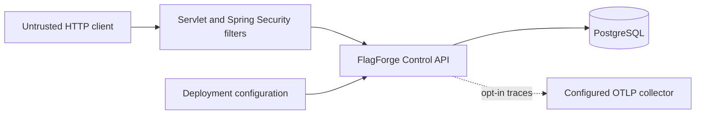
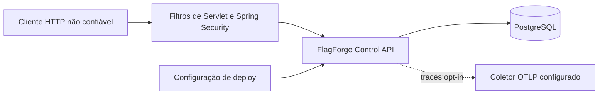

# Initial Threat Model

This document records the minimum security and observability boundaries that must exist before FlagForge begins implementing tenant-owned resources. It is intentionally scoped to the M0 Control API foundation and must evolve with the domain.

## Protected assets

- Tenant-owned configuration and resource existence.
- Environment-scoped SDK credentials and future operator sessions.
- Published feature-flag snapshots and audit history.
- PostgreSQL credentials and application configuration secrets.
- Targeting keys, user attributes, and complete evaluation contexts.
- Operational telemetry that could reveal customer or credential data.

## Trust boundaries

1. Every inbound HTTP request is untrusted, including headers such as `X-Correlation-ID`.
2. The security filter chain is the boundary before application routes and tenant lookups.
3. PostgreSQL is trusted as the application source of truth, but values read from it are still treated as data rather than executable input.
4. Environment variables and secret injection are deployment responsibilities. Local defaults are not production credentials.
5. OTLP export is outbound and disabled by default. Enabling it establishes a new trust relationship with the configured collector.

## Baseline controls

### Authentication and resource enumeration

Only minimal health and build-information endpoints are public. Every application route remains default-denied unless an explicit authentication path and permission are configured.

Human Control Plane authorization resolves organization identity from the authenticated principal, requires an ACTIVE membership, and checks an explicit permission before resource lookup. OWNER, ADMIN, DEVELOPER, and VIEWER roles use a fixed least-privilege matrix. Only OWNER can grant or alter OWNER authority.

Authentication failures use one generic RFC 9457 Problem Details contract. The response does not indicate whether an organization, project, environment, flag, or other tenant-owned resource exists. Cross-tenant and missing resources use the same generic not-found contract.

### Environment-scoped SDK credentials

SDK credentials are distinct from human operator identities and authorize evaluation only in one organization and environment. Each plaintext credential contains a 96-bit public lookup identifier and a cryptographically random 256-bit secret. Plaintext is returned only at creation or rotation.

PostgreSQL stores the lookup identifier, a SHA-256 hash of the random secret, scope, state, and lifecycle metadata. SHA-256 is appropriate here because the input is a uniformly random 256-bit secret rather than a human password. Authentication compares decoded hashes in constant time and validates ACTIVE state, EVALUATE scope, organization, and environment.

Rotation creates a replacement and revokes the previous credential in one transaction. Revocation immediately prevents subsequent authorization. Malformed, unknown, wrong-secret, revoked, cross-environment, and cross-tenant credentials all return the same generic failure and must never be logged.

### Request correlation

The API accepts `X-Correlation-ID` only when it contains 1 to 64 characters from a bounded safe character set. Invalid or missing values are replaced with a UUID. The effective identifier is returned to the caller and added to the logging MDC.

A correlation identifier is diagnostic metadata, not an authentication token, idempotency key, or authorization input.

### Logging and redaction

Console logs use structured ECS output. Trace identifiers and the effective correlation identifier can be included through MDC fields.

The application must not log:

- authorization or cookie headers;
- passwords, tokens, SDK keys, or database credentials;
- complete targeting contexts or arbitrary user attributes;
- raw request or response bodies by default.

When a diagnostic event needs user-related context, it must use an approved bounded category or an irreversible, explicitly reviewed representation. Logging utilities introduced later must centralize redaction rather than relying on callers to remember it.

### Metrics and traces

Metric labels must be bounded. A global meter filter rejects known sensitive or high-cardinality identity keys such as `targeting.key`, `subject.id`, `user.id`, `organization.id`, `sdk.key`, `credential`, and `token`.

Acceptable dimensions include bounded values such as evaluation reason, result type, cache layer, endpoint template, and success or failure category. Raw identifiers belong in neither metric names nor labels.

OpenTelemetry integration is present, but OTLP export is disabled by default. Sampling is configurable, and complete targeting contexts must never be added as span attributes.

### Health behavior

- Liveness reports only whether the process should be restarted and does not depend on PostgreSQL.
- Readiness includes PostgreSQL because the Control API cannot safely serve its principal workflows without its source of truth.
- Health details are never returned publicly.
- `/livez` and `/readyz` mirror the actuator probe groups on the main server port.

### HTTP responses

Responses include defensive browser headers even though the current service is an API. Error responses do not include exception types, stack traces, binding internals, secrets, or database details.

## Principal threats and mitigations

| Threat | Initial mitigation | Follow-up |
|---|---|---|
| Tenant resource enumeration | Authentication and permission checks before lookup, tenant-scoped repositories, and generic failures | Preserve negative isolation tests for every new tenant-owned aggregate |
| SDK credential theft from storage | Persist only a hash of a uniformly random 256-bit secret; return plaintext once | Add deployment secret-scanning and operational rotation guidance |
| Cross-environment SDK credential reuse | Bind authentication to organization, environment, EVALUATE scope, and ACTIVE status | Reuse the same boundary in the evaluation API and Java SDK |
| Credential or context leakage in telemetry | No body/header logging, structured redaction policy, prohibited metric tag keys | Preserve credential-redaction tests in the evaluation API and SDK |
| High-cardinality metric exhaustion | Global deny filter and bounded-tag guidance | Benchmark and telemetry review in #21 |
| Malicious correlation header | Strict validation, length limit, generated fallback | Preserve same policy across gateways and SDKs |
| Accidental public endpoint | Explicit actuator allowlist and `denyAll` fallback | Authorization matrix in #8 |
| Misleading health status | Separate liveness and database-backed readiness | Dependency-specific readiness review as services evolve |
| Trace data sent unintentionally | OTLP export disabled by default | Deployment checklist before enabling exporters |
| Detailed internal error leakage | Stable Problem Details and disabled stack/message exposure | Domain-specific problem catalog in later slices |

## Residual risk

The application now defines tenant memberships, Control Plane roles, explicit permissions, and environment-scoped SDK credential lifecycle semantics. It does not yet integrate an external human identity provider, expose production HTTP authentication endpoints, implement rate limiting, or provide protected-environment approval. The current default-deny posture prevents placeholder or future routes from becoming anonymously accessible while those boundaries remain under development.

Any change that introduces a new external dependency, credential type, public endpoint, tenant lookup, telemetry exporter, or request-body logging must update this threat model in the same pull request.

---

<strong>🇧🇷 Português (pt-BR)</strong>

# Modelo de Ameaças Inicial

Este documento registra as fronteiras mínimas de segurança e observabilidade que precisam existir antes de o FlagForge começar a implementar recursos pertencentes a tenants. Ele tem escopo intencionalmente limitado à fundação M0 da Control API e precisa evoluir com o domínio.

## Ativos protegidos

- Configuração pertencente ao tenant e a própria existência dos recursos.
- Credenciais de SDK com escopo de ambiente e futuras sessões de operador.
- Snapshots publicados de feature flags e histórico de auditoria.
- Credenciais do PostgreSQL e segredos de configuração da aplicação.
- Chaves de segmentação, atributos de usuário e contextos completos de avaliação.
- Telemetria operacional que possa revelar dados de cliente ou de credencial.

## Fronteiras de confiança

1. Toda requisição HTTP de entrada é não confiável, incluindo cabeçalhos como `X-Correlation-ID`.
2. A cadeia de filtros de segurança é a fronteira anterior às rotas da aplicação e às buscas de tenant.
3. O PostgreSQL é confiável como fonte da verdade da aplicação, mas os valores lidos dele continuam sendo tratados como dados, e não como entrada executável.
4. Variáveis de ambiente e injeção de segredos são responsabilidades do deploy. Os padrões locais não são credenciais de produção.
5. A exportação OTLP é de saída e vem desabilitada por padrão. Habilitá-la estabelece uma nova relação de confiança com o coletor configurado.

## Controles de baseline

### Autenticação e enumeração de recursos

Apenas endpoints mínimos de health e de informação de build são públicos. Toda rota de aplicação permanece negada por padrão, salvo se um caminho explícito de autenticação e uma permissão forem configurados.

A autorização humana no Plano de Controle resolve a identidade da organização a partir do principal autenticado, exige uma associação ACTIVE e verifica uma permissão explícita antes da busca do recurso. Os papéis OWNER, ADMIN, DEVELOPER e VIEWER usam uma matriz fixa de menor privilégio. Somente OWNER pode conceder ou alterar autoridade de OWNER.

Falhas de autenticação usam um único contrato genérico de Problem Details (RFC 9457). A resposta não indica se uma organização, projeto, ambiente, flag ou outro recurso pertencente a um tenant existe. Recursos de outro tenant e recursos ausentes usam o mesmo contrato genérico de "não encontrado".

### Credenciais de SDK com escopo de ambiente

Credenciais de SDK são distintas de identidades humanas de operador e autorizam apenas avaliação em uma organização e um ambiente. Cada credencial em texto plano contém um identificador público de consulta de 96 bits e um segredo aleatório criptográfico de 256 bits. O texto plano só é retornado na criação ou na rotação.

O PostgreSQL armazena o identificador de consulta, um hash SHA-256 do segredo aleatório, o escopo, o estado e os metadados de ciclo de vida. SHA-256 é apropriado aqui porque a entrada é um segredo uniformemente aleatório de 256 bits, e não uma senha humana. A autenticação compara hashes decodificados em tempo constante e valida o estado ACTIVE, o escopo EVALUATE, a organização e o ambiente.

A rotação cria uma substituta e revoga a credencial anterior em uma única transação. A revogação impede imediatamente autorizações subsequentes. Credenciais malformadas, desconhecidas, com segredo incorreto, revogadas, de outro ambiente e de outro tenant retornam todas a mesma falha genérica e nunca devem ser registradas em log.

### Correlação de requisições

A API aceita `X-Correlation-ID` apenas quando ele contém de 1 a 64 caracteres de um conjunto seguro e limitado. Valores inválidos ou ausentes são substituídos por um UUID. O identificador efetivo é devolvido a quem chamou e adicionado ao MDC de logging.

Um identificador de correlação é metadado de diagnóstico, e não um token de autenticação, chave de idempotência ou entrada de autorização.

### Logging e redação

Os logs de console usam saída estruturada em ECS. Identificadores de trace e o identificador de correlação efetivo podem ser incluídos por meio de campos do MDC.

A aplicação não deve registrar em log:

- cabeçalhos de autorização ou de cookie;
- senhas, tokens, chaves de SDK ou credenciais de banco de dados;
- contextos completos de segmentação ou atributos arbitrários de usuário;
- corpos brutos de requisição ou resposta por padrão.

Quando um evento de diagnóstico precisar de contexto relacionado ao usuário, ele deve usar uma categoria limitada aprovada ou uma representação irreversível e explicitamente revisada. Utilitários de logging introduzidos depois precisam centralizar a redação, em vez de depender de quem chama lembrar dela.

### Métricas e traces

Os rótulos de métrica precisam ser limitados. Um filtro global de meter rejeita chaves de identidade conhecidas como sensíveis ou de alta cardinalidade, como `targeting.key`, `subject.id`, `user.id`, `organization.id`, `sdk.key`, `credential` e `token`.

Dimensões aceitáveis incluem valores limitados, como razão da avaliação, tipo de resultado, camada de cache, template de endpoint e categoria de sucesso ou falha. Identificadores brutos não pertencem nem a nomes nem a rótulos de métrica.

A integração com OpenTelemetry está presente, mas a exportação OTLP vem desabilitada por padrão. A amostragem é configurável, e contextos completos de segmentação nunca devem ser adicionados como atributos de span.

### Comportamento de health

- O liveness reporta somente se o processo deve ser reiniciado e não depende do PostgreSQL.
- O readiness inclui o PostgreSQL, porque a Control API não consegue servir com segurança seus fluxos principais sem sua fonte da verdade.
- Detalhes de health nunca são retornados publicamente.
- `/livez` e `/readyz` espelham os grupos de probe do actuator na porta principal do servidor.

### Respostas HTTP

As respostas incluem cabeçalhos defensivos de navegador, mesmo o serviço atual sendo uma API. Respostas de erro não incluem tipos de exceção, stack traces, detalhes internos de binding, segredos ou detalhes de banco de dados.

## Principais ameaças e mitigações

| Ameaça | Mitigação inicial | Próximo passo |
|---|---|---|
| Enumeração de recursos de tenant | Checagens de autenticação e permissão antes da busca, repositórios com escopo de tenant e falhas genéricas | Preservar testes negativos de isolamento para cada novo agregado pertencente a tenant |
| Roubo de credencial de SDK do armazenamento | Persistir apenas o hash de um segredo uniformemente aleatório de 256 bits; retornar o texto plano uma única vez | Adicionar varredura de segredos no deploy e orientação operacional de rotação |
| Reuso de credencial de SDK entre ambientes | Vincular a autenticação a organização, ambiente, escopo EVALUATE e status ACTIVE | Reutilizar a mesma fronteira na API de avaliação e no SDK Java |
| Vazamento de credencial ou contexto na telemetria | Sem logging de corpo/cabeçalhos, política estruturada de redação, chaves de tag de métrica proibidas | Preservar testes de redação de credenciais na API de avaliação e no SDK |
| Exaustão por métricas de alta cardinalidade | Filtro global de negação e orientação de tags limitadas | Revisão de benchmark e telemetria na #21 |
| Cabeçalho de correlação malicioso | Validação estrita, limite de comprimento, fallback gerado | Preservar a mesma política em gateways e SDKs |
| Endpoint público acidental | Allowlist explícita do actuator e fallback `denyAll` | Matriz de autorização na #8 |
| Status de health enganoso | Liveness e readiness apoiado em banco de dados separados | Revisão de readiness específica por dependência conforme os serviços evoluem |
| Dados de trace enviados sem intenção | Exportação OTLP desabilitada por padrão | Checklist de deploy antes de habilitar exportadores |
| Vazamento detalhado de erro interno | Problem Details estáveis e exposição de stack/mensagem desabilitada | Catálogo de problemas específico de domínio em fatias posteriores |

## Risco residual

A aplicação agora define associações de tenant, papéis do Plano de Controle, permissões explícitas e a semântica de ciclo de vida das credenciais de SDK com escopo de ambiente. Ela ainda não integra um provedor externo de identidade humana, não expõe endpoints HTTP de autenticação de produção, não implementa limitação de taxa nem oferece aprovação de ambiente protegido. A postura atual de negar por padrão impede que rotas de reserva ou futuras se tornem acessíveis anonimamente enquanto essas fronteiras seguem em desenvolvimento.

Toda mudança que introduza uma nova dependência externa, tipo de credencial, endpoint público, busca de tenant, exportador de telemetria ou logging de corpo de requisição precisa atualizar este modelo de ameaças no mesmo pull request.

