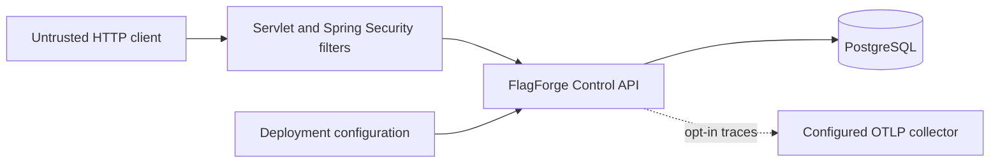

# Initial Threat Model

This document records the minimum security and observability boundaries that must exist before FlagForge begins implementing tenant-owned resources. It is intentionally scoped to the M0 Control API foundation and must evolve with the domain.

## Protected assets

- Tenant-owned configuration and resource existence.
- Environment-scoped SDK credentials and future operator sessions.
- Published feature-flag snapshots and audit history.
- PostgreSQL credentials and application configuration secrets.
- Targeting keys, user attributes, and complete evaluation contexts.
- Operational telemetry that could reveal customer or credential data.

## Trust boundaries

1. Every inbound HTTP request is untrusted, including headers such as `X-Correlation-ID`.
2. The security filter chain is the boundary before application routes and tenant lookups.
3. PostgreSQL is trusted as the application source of truth, but values read from it are still treated as data rather than executable input.
4. Environment variables and secret injection are deployment responsibilities. Local defaults are not production credentials.
5. OTLP export is outbound and disabled by default. Enabling it establishes a new trust relationship with the configured collector.

## Baseline controls

### Authentication and resource enumeration

Only minimal health and build-information endpoints are public. Every application route remains default-denied unless an explicit authentication path and permission are configured.

Human Control Plane authorization resolves organization identity from the authenticated principal, requires an ACTIVE membership, and checks an explicit permission before resource lookup. OWNER, ADMIN, DEVELOPER, and VIEWER roles use a fixed least-privilege matrix. Only OWNER can grant or alter OWNER authority.

Authentication failures use one generic RFC 9457 Problem Details contract. The response does not indicate whether an organization, project, environment, flag, or other tenant-owned resource exists. Cross-tenant and missing resources use the same generic not-found contract.

### Environment-scoped SDK credentials

SDK credentials are distinct from human operator identities and authorize evaluation only in one organization and environment. Each plaintext credential contains a 96-bit public lookup identifier and a cryptographically random 256-bit secret. Plaintext is returned only at creation or rotation.

PostgreSQL stores the lookup identifier, a SHA-256 hash of the random secret, scope, state, and lifecycle metadata. SHA-256 is appropriate here because the input is a uniformly random 256-bit secret rather than a human password. Authentication compares decoded hashes in constant time and validates ACTIVE state, EVALUATE scope, organization, and environment.

Rotation creates a replacement and revokes the previous credential in one transaction. Revocation immediately prevents subsequent authorization. Malformed, unknown, wrong-secret, revoked, cross-environment, and cross-tenant credentials all return the same generic failure and must never be logged.

### Request correlation

The API accepts `X-Correlation-ID` only when it contains 1 to 64 characters from a bounded safe character set. Invalid or missing values are replaced with a UUID. The effective identifier is returned to the caller and added to the logging MDC.

A correlation identifier is diagnostic metadata, not an authentication token, idempotency key, or authorization input.

### Logging and redaction

Console logs use structured ECS output. Trace identifiers and the effective correlation identifier can be included through MDC fields.

The application must not log:

- authorization or cookie headers;
- passwords, tokens, SDK keys, or database credentials;
- complete targeting contexts or arbitrary user attributes;
- raw request or response bodies by default.

When a diagnostic event needs user-related context, it must use an approved bounded category or an irreversible, explicitly reviewed representation. Logging utilities introduced later must centralize redaction rather than relying on callers to remember it.

### Metrics and traces

Metric labels must be bounded. A global meter filter rejects known sensitive or high-cardinality identity keys such as `targeting.key`, `subject.id`, `user.id`, `organization.id`, `sdk.key`, `credential`, and `token`.

Acceptable dimensions include bounded values such as evaluation reason, result type, cache layer, endpoint template, and success or failure category. Raw identifiers belong in neither metric names nor labels.

OpenTelemetry integration is present, but OTLP export is disabled by default. Sampling is configurable, and complete targeting contexts must never be added as span attributes.

### Health behavior

- Liveness reports only whether the process should be restarted and does not depend on PostgreSQL.
- Readiness includes PostgreSQL because the Control API cannot safely serve its principal workflows without its source of truth.
- Health details are never returned publicly.
- `/livez` and `/readyz` mirror the actuator probe groups on the main server port.

### HTTP responses

Responses include defensive browser headers even though the current service is an API. Error responses do not include exception types, stack traces, binding internals, secrets, or database details.

## Principal threats and mitigations

| Threat | Initial mitigation | Follow-up |
|---|---|---|
| Tenant resource enumeration | Authentication and permission checks before lookup, tenant-scoped repositories, and generic failures | Preserve negative isolation tests for every new tenant-owned aggregate |
| SDK credential theft from storage | Persist only a hash of a uniformly random 256-bit secret; return plaintext once | Add deployment secret-scanning and operational rotation guidance |
| Cross-environment SDK credential reuse | Bind authentication to organization, environment, EVALUATE scope, and ACTIVE status | Reuse the same boundary in the evaluation API and Java SDK |
| Credential or context leakage in telemetry | No body/header logging, structured redaction policy, prohibited metric tag keys | Preserve credential-redaction tests in the evaluation API and SDK |
| High-cardinality metric exhaustion | Global deny filter and bounded-tag guidance | Benchmark and telemetry review in #21 |
| Malicious correlation header | Strict validation, length limit, generated fallback | Preserve same policy across gateways and SDKs |
| Accidental public endpoint | Explicit actuator allowlist and `denyAll` fallback | Authorization matrix in #8 |
| Misleading health status | Separate liveness and database-backed readiness | Dependency-specific readiness review as services evolve |
| Trace data sent unintentionally | OTLP export disabled by default | Deployment checklist before enabling exporters |
| Detailed internal error leakage | Stable Problem Details and disabled stack/message exposure | Domain-specific problem catalog in later slices |

## Residual risk

The application now defines tenant memberships, Control Plane roles, explicit permissions, and environment-scoped SDK credential lifecycle semantics. It does not yet integrate an external human identity provider, expose production HTTP authentication endpoints, implement rate limiting, or provide protected-environment approval. The current default-deny posture prevents placeholder or future routes from becoming anonymously accessible while those boundaries remain under development.

Any change that introduces a new external dependency, credential type, public endpoint, tenant lookup, telemetry exporter, or request-body logging must update this threat model in the same pull request.
